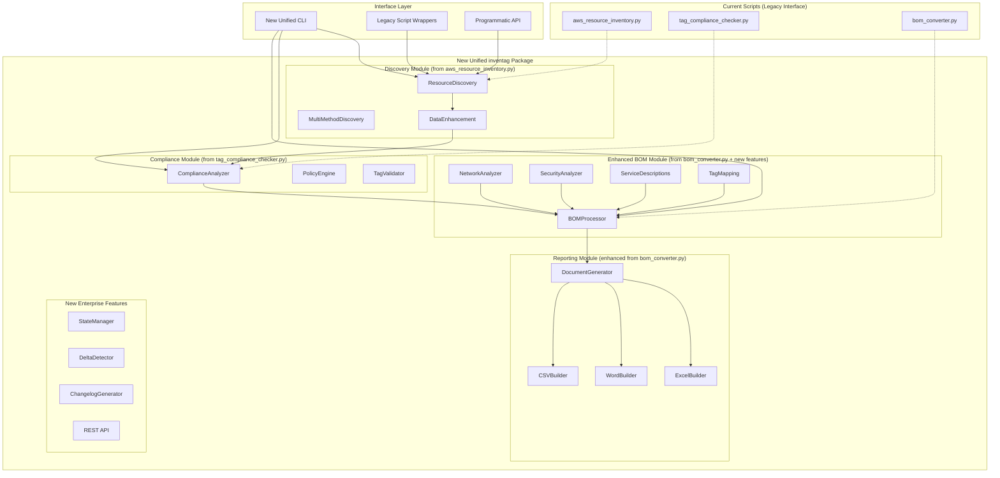
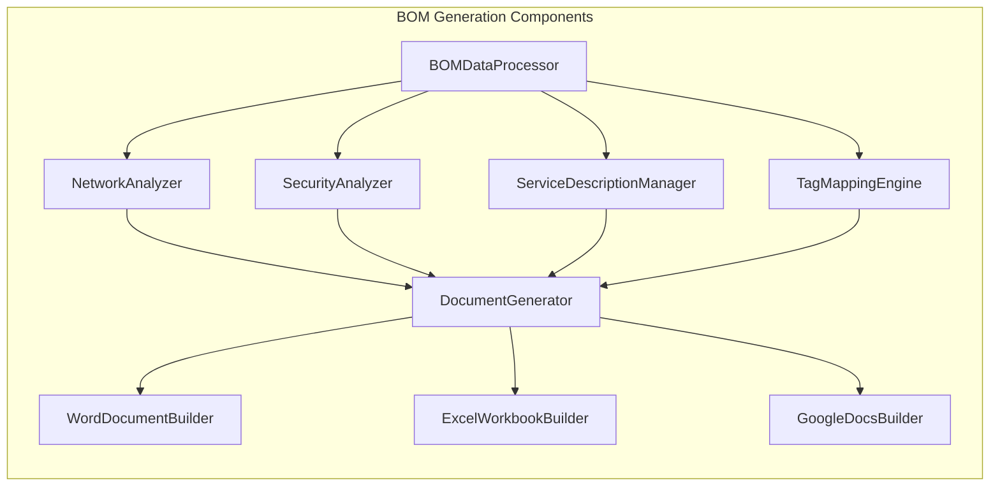

# InvenTag Unified Platform Design Document

## Overview

This design document outlines the architectural transformation of InvenTag from a collection of standalone scripts into a unified, enterprise-grade cloud governance platform with BOM generation as a first-class feature. This transformation leverages the battle-tested functionality in the existing scripts while creating a cohesive, service-ready architecture that positions InvenTag as a comprehensive cloud governance solution.

The design preserves the proven value of the current script-based approach (`aws_resource_inventory.py`, `tag_compliance_checker.py`, `bom_converter.py`) while extracting and refactoring this functionality into a modular `inventag` Python package with clear separation of concerns and enterprise-grade capabilities.

**Current State Analysis**:
- **Comprehensive Discovery Engine**: `aws_resource_inventory.py` provides multi-method resource discovery across all AWS services with intelligent fallbacks and cross-region scanning
- **Enterprise Compliance Framework**: `tag_compliance_checker.py` offers robust tag validation with flexible policy configuration and professional reporting
- **Professional BOM Generation**: `bom_converter.py` generates Excel/CSV reports with VPC enrichment, data standardization, and service-specific organization
- **Production-Ready Foundation**: All components are battle-tested in enterprise environments with comprehensive error handling and CI/CD integration

**Architectural Transformation Principles**:
- **Preserve Proven Value**: Maintain all existing functionality while elevating architecture to enterprise standards
- **Unified Core Library**: Extract and refactor functionality into cohesive `inventag` package modules with clear interfaces
- **First-Class BOM Generation**: Elevate BOM generation from utility script to core platform capability with advanced features
- **Service-Ready Architecture**: Design supports seamless scaling from CLI tools to microservices and serverless functions
- **Backward Compatibility**: Existing scripts become thin wrappers around the new core library, preserving all interfaces
- **Modular Design**: Clear separation between discovery, compliance, enhancement, analysis, and reporting layers
- **Enterprise Integration**: Native support for multi-account environments, CI/CD workflows, and audit trail generation

## Architecture

### Migration from Current Scripts to Unified Architecture



### Unified Package Architecture

The new architecture extracts and enhances the proven functionality from existing scripts while maintaining backward compatibility:

**From `aws_resource_inventory.py` → `inventag.discovery` module**:
- Multi-method resource discovery (ResourceGroups, Config, Service APIs) with enhanced error handling
- Cross-region scanning with intelligent fallbacks and parallel processing
- Data standardization and deduplication with improved algorithms
- S3 upload capabilities with configurable bucket policies and encryption

**From `tag_compliance_checker.py` → `inventag.compliance` module**:
- Comprehensive tag policy validation with enhanced rule engine
- Service-by-service compliance analysis with detailed reporting
- Flexible policy configuration (YAML/JSON) with schema validation
- Detailed compliance reporting with trend analysis and delta detection

**From `bom_converter.py` → `inventag.reporting` module**:
- Professional Excel/CSV generation with advanced formatting
- VPC/subnet name enrichment with caching and performance optimization
- Service-specific sheet organization with customizable layouts
- Data transformation and standardization with extensible pipelines

**New Enterprise Enhancements**:
- Advanced network and security analysis with risk assessment
- Professional Word document generation with template system
- State management and delta detection for change tracking
- Service-ready REST API architecture for microservice deployment
- Multi-account support with centralized credential management
- CI/CD integration with GitHub Actions compatibility

### Component Architecture



## Components and Interfaces

### 1. BOMDataProcessor

**Purpose**: Central orchestrator that processes raw inventory data and coordinates with specialized analyzers.

**Interface**:
```python
class BOMDataProcessor:
    def __init__(self, config: BOMConfig):
        self.config = config
        self.network_analyzer = NetworkAnalyzer()
        self.security_analyzer = SecurityAnalyzer()
        self.service_desc_manager = ServiceDescriptionManager(config.service_descriptions)
        self.tag_mapping_engine = TagMappingEngine(config.tag_mappings)
        self.service_enricher = ServiceAttributeEnricher()
    
    def process_inventory_data(self, inventory_data: List[Dict]) -> BOMData:
        """Process raw inventory data into BOM-ready format"""
        
    def enrich_with_network_analysis(self, resources: List[Dict]) -> List[Dict]:
        """Add VPC/subnet analysis to resources"""
        
    def enrich_with_security_analysis(self, resources: List[Dict]) -> List[Dict]:
        """Add security group analysis to resources"""
        
    def enrich_with_service_attributes(self, resources: List[Dict]) -> List[Dict]:
        """Enrich resources with service-specific attributes"""
        
    def apply_service_descriptions(self, resources: List[Dict]) -> List[Dict]:
        """Add custom service descriptions"""
        
    def apply_tag_mappings(self, resources: List[Dict]) -> List[Dict]:
        """Apply custom tag attribute mappings"""
```

### 2. NetworkAnalyzer

**Purpose**: Analyzes VPC, subnet, and CIDR information to provide network visibility and capacity planning data.

**Interface**:
```python
class NetworkAnalyzer:
    def __init__(self):
        self.vpc_cache = {}
        self.subnet_cache = {}
    
    def analyze_vpc_resources(self, resources: List[Dict]) -> Dict[str, VPCAnalysis]:
        """Analyze VPC resources and calculate CIDR utilization"""
        
    def calculate_subnet_utilization(self, subnet_resources: List[Dict]) -> Dict[str, SubnetAnalysis]:
        """Calculate IP utilization per subnet"""
        
    def map_resources_to_network(self, resources: List[Dict]) -> List[Dict]:
        """Map EC2/RDS resources to their VPC/subnet context"""
        
    def generate_network_summary(self, vpc_analysis: Dict) -> NetworkSummary:
        """Generate network capacity summary for BOM"""

@dataclass
class VPCAnalysis:
    vpc_id: str
    vpc_name: str
    cidr_block: str
    total_ips: int
    available_ips: int
    utilization_percentage: float
    subnets: List[SubnetAnalysis]
    associated_resources: List[str]

@dataclass
class SubnetAnalysis:
    subnet_id: str
    subnet_name: str
    cidr_block: str
    availability_zone: str
    total_ips: int
    available_ips: int
    utilization_percentage: float
    associated_resources: List[str]
```

### 3. SecurityAnalyzer

**Purpose**: Analyzes security groups, NACLs, and access patterns to provide comprehensive security documentation.

**Interface**:
```python
class SecurityAnalyzer:
    def analyze_security_groups(self, sg_resources: List[Dict]) -> Dict[str, SecurityGroupAnalysis]:
        """Analyze security group rules and relationships"""
        
    def identify_overly_permissive_rules(self, sg_analysis: Dict) -> List[SecurityRisk]:
        """Identify security risks like 0.0.0.0/0 access"""
        
    def analyze_nacls(self, nacl_resources: List[Dict]) -> Dict[str, NACLAnalysis]:
        """Analyze Network ACL configurations"""
        
    def map_resources_to_security_groups(self, resources: List[Dict]) -> List[Dict]:
        """Map resources to their security group associations"""
        
    def generate_security_summary(self, analysis: Dict) -> SecuritySummary:
        """Generate security overview for BOM"""

@dataclass
class SecurityGroupAnalysis:
    group_id: str
    group_name: str
    description: str
    vpc_id: str
    inbound_rules: List[SecurityRule]
    outbound_rules: List[SecurityRule]
    associated_resources: List[str]
    risk_level: str
    
@dataclass
class SecurityRule:
    protocol: str
    port_range: str
    source_destination: str
    description: str
    risk_assessment: str
```

### 4. ServiceDescriptionManager

**Purpose**: Manages custom service descriptions from configuration files and applies them to resources.

**Interface**:
```python
class ServiceDescriptionManager:
    def __init__(self, descriptions_config: Dict):
        self.descriptions = self._load_descriptions(descriptions_config)
    
    def get_service_description(self, service: str, resource_type: str = None) -> str:
        """Get custom description for AWS service/resource type"""
        
    def apply_descriptions_to_resources(self, resources: List[Dict]) -> List[Dict]:
        """Add service descriptions to resource data"""
        
    def reload_descriptions(self, config_path: str):
        """Reload descriptions from updated config file"""

# Configuration format:
service_descriptions = {
    "EC2": {
        "default": "Amazon Elastic Compute Cloud - Virtual servers in the cloud",
        "Instance": "Virtual machine instances providing scalable compute capacity",
        "Volume": "Block storage volumes attached to EC2 instances"
    },
    "S3": {
        "default": "Amazon Simple Storage Service - Object storage service",
        "Bucket": "Container for objects stored in Amazon S3"
    }
}
```

### 5. TagMappingEngine

**Purpose**: Handles custom tag attribute mappings and extracts organization-specific metadata.

**Interface**:
```python
class TagMappingEngine:
    def __init__(self, tag_mappings: Dict):
        self.mappings = tag_mappings
    
    def extract_custom_attributes(self, resource: Dict) -> Dict[str, str]:
        """Extract custom attributes based on tag mappings"""
        
    def apply_mappings_to_resources(self, resources: List[Dict]) -> List[Dict]:
        """Apply tag mappings to all resources"""
        
    def get_custom_columns(self) -> List[str]:
        """Get list of custom column headers for BOM documents"""

# Configuration format:
tag_mappings = {
    "inventag:remarks": {
        "column_name": "Remarks",
        "default_value": "",
        "description": "Additional remarks about the resource"
    },
    "inventag:costcenter": {
        "column_name": "Cost Center",
        "default_value": "Unknown",
        "description": "Cost center responsible for the resource"
    }
}
```

### 6. DocumentGenerator

**Purpose**: Orchestrates document generation across different formats with consistent data and styling.

**Interface**:
```python
class DocumentGenerator:
    def __init__(self, config: DocumentConfig):
        self.config = config
        self.word_builder = WordDocumentBuilder(config)
        self.excel_builder = ExcelWorkbookBuilder(config)
        self.google_builder = GoogleDocsBuilder(config)
    
    def generate_bom_documents(self, bom_data: BOMData, formats: List[str]) -> List[str]:
        """Generate BOM documents in specified formats"""
        
    def apply_branding(self, document, format_type: str):
        """Apply organization branding to documents"""
        
    def validate_document_structure(self, bom_data: BOMData) -> bool:
        """Validate data structure before document generation"""

@dataclass
class BOMData:
    resources: List[Dict]
    network_analysis: Dict[str, VPCAnalysis]
    security_analysis: Dict[str, SecurityGroupAnalysis]
    compliance_summary: ComplianceSummary
    generation_metadata: Dict
    custom_attributes: List[str]
```

### 7. ServiceAttributeEnricher

**Purpose**: Dynamically discovers all AWS services and enriches resources with service-specific attributes using read-only APIs.

**Interface**:
```python
class ServiceAttributeEnricher:
    def __init__(self):
        self.service_handlers = self._initialize_service_handlers()
        self.discovered_services = set()
        self.unknown_services = set()
    
    def discover_all_services(self, resources: List[Dict]) -> Set[str]:
        """Discover all AWS services from resource inventory"""
        
    def enrich_resources_with_attributes(self, resources: List[Dict]) -> List[Dict]:
        """Enrich all resources with service-specific attributes"""
        
    def handle_unknown_service(self, service: str, resource: Dict) -> Dict:
        """Dynamically handle unknown services using generic patterns"""
        
    def get_service_specific_attributes(self, service: str, resource: Dict) -> Dict:
        """Get detailed attributes for specific service resources"""

class ServiceHandler:
    """Base class for service-specific attribute handlers"""
    
    def __init__(self, session: boto3.Session):
        self.session = session
        
    def can_handle(self, service: str, resource_type: str) -> bool:
        """Check if this handler can process the service/resource type"""
        
    def enrich_resource(self, resource: Dict) -> Dict:
        """Enrich resource with service-specific attributes"""
        
    def get_read_only_operations(self) -> List[str]:
        """Return list of read-only operations this handler uses"""

# Service-specific handlers for comprehensive attribute fetching
class S3Handler(ServiceHandler):
    def enrich_resource(self, resource: Dict) -> Dict:
        """Enrich S3 resources with bucket-specific attributes"""
        # Get bucket encryption, versioning, lifecycle, ACL, policy, etc.
        bucket_name = resource['id']
        
        attributes = {}
        try:
            # Bucket encryption
            encryption = self.s3_client.get_bucket_encryption(Bucket=bucket_name)
            attributes['encryption'] = encryption.get('ServerSideEncryptionConfiguration', {})
            
            # Versioning
            versioning = self.s3_client.get_bucket_versioning(Bucket=bucket_name)
            attributes['versioning_status'] = versioning.get('Status', 'Disabled')
            
            # Object lock configuration
            try:
                object_lock = self.s3_client.get_object_lock_configuration(Bucket=bucket_name)
                attributes['object_lock'] = object_lock.get('ObjectLockConfiguration', {})
            except ClientError:
                attributes['object_lock'] = None
                
            # Lifecycle configuration
            try:
                lifecycle = self.s3_client.get_bucket_lifecycle_configuration(Bucket=bucket_name)
                attributes['lifecycle_rules'] = lifecycle.get('Rules', [])
            except ClientError:
                attributes['lifecycle_rules'] = []
                
            # Public access block
            try:
                public_access = self.s3_client.get_public_access_block(Bucket=bucket_name)
                attributes['public_access_block'] = public_access.get('PublicAccessBlockConfiguration', {})
            except ClientError:
                attributes['public_access_block'] = {}
                
        except ClientError as e:
            attributes['error'] = str(e)
            
        return {**resource, 'service_attributes': attributes}

class GlueHandler(ServiceHandler):
    def enrich_resource(self, resource: Dict) -> Dict:
        """Enrich Glue resources with job/crawler/database specific attributes"""
        resource_type = resource.get('type', '')
        resource_id = resource.get('id', '')
        
        attributes = {}
        try:
            if resource_type == 'Job':
                job_details = self.glue_client.get_job(JobName=resource_id)
                job = job_details.get('Job', {})
                attributes.update({
                    'role': job.get('Role'),
                    'glue_version': job.get('GlueVersion'),
                    'max_capacity': job.get('MaxCapacity'),
                    'worker_type': job.get('WorkerType'),
                    'number_of_workers': job.get('NumberOfWorkers'),
                    'timeout': job.get('Timeout'),
                    'security_configuration': job.get('SecurityConfiguration')
                })
                
            elif resource_type == 'Crawler':
                crawler_details = self.glue_client.get_crawler(Name=resource_id)
                crawler = crawler_details.get('Crawler', {})
                attributes.update({
                    'role': crawler.get('Role'),
                    'database_name': crawler.get('DatabaseName'),
                    'schedule': crawler.get('Schedule'),
                    'state': crawler.get('State'),
                    'table_prefix': crawler.get('TablePrefix')
                })
                
            elif resource_type == 'Database':
                database_details = self.glue_client.get_database(Name=resource_id)
                database = database_details.get('Database', {})
                attributes.update({
                    'description': database.get('Description'),
                    'location_uri': database.get('LocationUri'),
                    'parameters': database.get('Parameters', {})
                })
                
        except ClientError as e:
            attributes['error'] = str(e)
            
        return {**resource, 'service_attributes': attributes}

class SageMakerHandler(ServiceHandler):
    def enrich_resource(self, resource: Dict) -> Dict:
        """Enrich SageMaker resources with ML-specific attributes"""
        resource_type = resource.get('type', '')
        resource_id = resource.get('id', '')
        
        attributes = {}
        try:
            if resource_type == 'NotebookInstance':
                instance_details = self.sagemaker_client.describe_notebook_instance(
                    NotebookInstanceName=resource_id
                )
                attributes.update({
                    'instance_type': instance_details.get('InstanceType'),
                    'notebook_instance_status': instance_details.get('NotebookInstanceStatus'),
                    'role_arn': instance_details.get('RoleArn'),
                    'subnet_id': instance_details.get('SubnetId'),
                    'security_groups': instance_details.get('SecurityGroups', []),
                    'volume_size_in_gb': instance_details.get('VolumeSizeInGB'),
                    'default_code_repository': instance_details.get('DefaultCodeRepository')
                })
                
            elif resource_type == 'Model':
                model_details = self.sagemaker_client.describe_model(ModelName=resource_id)
                attributes.update({
                    'execution_role_arn': model_details.get('ExecutionRoleArn'),
                    'primary_container': model_details.get('PrimaryContainer', {}),
                    'vpc_config': model_details.get('VpcConfig', {}),
                    'enable_network_isolation': model_details.get('EnableNetworkIsolation')
                })
                
            elif resource_type == 'EndpointConfig':
                config_details = self.sagemaker_client.describe_endpoint_config(
                    EndpointConfigName=resource_id
                )
                attributes.update({
                    'production_variants': config_details.get('ProductionVariants', []),
                    'kms_key_id': config_details.get('KmsKeyId'),
                    'data_capture_config': config_details.get('DataCaptureConfig', {})
                })
                
        except ClientError as e:
            attributes['error'] = str(e)
            
        return {**resource, 'service_attributes': attributes}

class DynamicServiceHandler(ServiceHandler):
    """Generic handler for unknown services using pattern-based discovery"""
    
    def enrich_resource(self, resource: Dict) -> Dict:
        """Attempt to enrich unknown service resources using common patterns"""
        service = resource.get('service', '').lower()
        resource_type = resource.get('type', '')
        resource_id = resource.get('id', '')
        arn = resource.get('arn', '')
        
        attributes = {}
        
        try:
            # Try to get a client for the service
            client = self.session.client(service)
            
            # Common patterns for describe operations
            describe_patterns = [
                f'describe_{resource_type.lower()}',
                f'describe_{resource_type.lower()}s',
                f'get_{resource_type.lower()}',
                f'get_{resource_type.lower()}s'
            ]
            
            for pattern in describe_patterns:
                if hasattr(client, pattern):
                    try:
                        # Try common parameter patterns
                        operation = getattr(client, pattern)
                        
                        # Try different parameter name patterns
                        param_patterns = [
                            {f'{resource_type}Name': resource_id},
                            {f'{resource_type}Id': resource_id},
                            {'Name': resource_id},
                            {'Id': resource_id},
                            {'ResourceArn': arn}
                        ]
                        
                        for params in param_patterns:
                            try:
                                response = operation(**params)
                                # Extract the main resource object from response
                                for key, value in response.items():
                                    if isinstance(value, dict) and key != 'ResponseMetadata':
                                        attributes.update(value)
                                        break
                                break
                            except ClientError:
                                continue
                                
                        if attributes:
                            break
                            
                    except Exception:
                        continue
                        
        except Exception as e:
            attributes['discovery_error'] = str(e)
            
        return {**resource, 'service_attributes': attributes}

# Service handler registry
SERVICE_HANDLERS = {
    'S3': S3Handler,
    'GLUE': GlueHandler,
    'SAGEMAKER': SageMakerHandler,
    'ROBOMAKER': DynamicServiceHandler,  # Will use pattern-based discovery
    'COMPREHEND': DynamicServiceHandler,
    'TEXTRACT': DynamicServiceHandler,
    'REKOGNITION': DynamicServiceHandler,
    # Add more specific handlers as needed, fallback to DynamicServiceHandler
}
```

### 8. Format-Specific Builders

**WordDocumentBuilder**:
```python
class WordDocumentBuilder:
    def create_bom_document(self, bom_data: BOMData) -> str:
        """Create Word document with professional formatting"""
        
    def create_executive_summary(self, bom_data: BOMData) -> Section:
        """Create executive summary section"""
        
    def create_resource_tables(self, resources: List[Dict]) -> List[Table]:
        """Create service-specific resource tables"""
        
    def create_network_analysis_section(self, network_data: Dict) -> Section:
        """Create VPC/subnet analysis section"""
        
    def create_security_analysis_section(self, security_data: Dict) -> Section:
        """Create security group analysis section"""
```

**ExcelWorkbookBuilder**:
```python
class ExcelWorkbookBuilder:
    def create_bom_workbook(self, bom_data: BOMData) -> str:
        """Create Excel workbook with multiple sheets"""
        
    def create_summary_sheet(self, bom_data: BOMData) -> Worksheet:
        """Create executive summary dashboard sheet"""
        
    def create_service_sheets(self, resources: List[Dict]) -> List[Worksheet]:
        """Create separate sheets for each AWS service"""
        
    def create_network_analysis_sheet(self, network_data: Dict) -> Worksheet:
        """Create VPC/subnet analysis sheet"""
        
    def create_security_analysis_sheet(self, security_data: Dict) -> Worksheet:
        """Create security group analysis sheet"""
        
    def apply_conditional_formatting(self, worksheet: Worksheet):
        """Apply compliance status highlighting"""
```

## Data Models

### Core Data Structures

```python
@dataclass
class BOMConfig:
    service_descriptions: Dict
    tag_mappings: Dict
    document_templates: Dict
    branding: BrandingConfig
    output_formats: List[str]
    field_visibility: Dict[str, bool]

@dataclass
class BrandingConfig:
    company_name: str
    logo_path: str
    header_text: str
    footer_text: str
    color_scheme: Dict[str, str]

@dataclass
class ComplianceSummary:
    total_resources: int
    compliant_resources: int
    non_compliant_resources: int
    compliance_percentage: float
    top_violations: List[str]
    
@dataclass
class NetworkSummary:
    total_vpcs: int
    total_subnets: int
    total_available_ips: int
    highest_utilization_subnet: str
    vpc_utilization_stats: Dict
    
@dataclass
class SecuritySummary:
    total_security_groups: int
    overly_permissive_rules: int
    unused_security_groups: int
    high_risk_resources: List[str]
    security_recommendations: List[str]
```

## Error Handling

### Error Categories and Handling Strategy

1. **Configuration Errors**:
   - Missing service descriptions file
   - Invalid tag mapping configuration
   - Template file not found
   - **Handling**: Graceful degradation with default values, clear error messages

2. **Data Processing Errors**:
   - Malformed inventory data
   - Missing required fields
   - Network analysis failures
   - **Handling**: Skip problematic resources, log warnings, continue processing

3. **Document Generation Errors**:
   - Template rendering failures
   - File system permissions
   - Format-specific library issues
   - **Handling**: Retry with fallback templates, alternative formats

4. **Network/API Errors**:
   - AWS API rate limiting
   - Google Docs API failures
   - Network connectivity issues
   - **Handling**: Exponential backoff, offline mode for local formats

### Error Recovery Mechanisms

```python
class BOMErrorHandler:
    def handle_configuration_error(self, error: ConfigError) -> BOMConfig:
        """Provide default configuration when config is invalid"""
        
    def handle_data_processing_error(self, error: DataError, resource: Dict) -> Optional[Dict]:
        """Skip problematic resources and log issues"""
        
    def handle_document_generation_error(self, error: DocumentError, format_type: str) -> bool:
        """Attempt fallback generation strategies"""
```

## Testing Strategy

### Unit Testing
- **Component Testing**: Each analyzer and builder component with comprehensive mock coverage
- **Data Processing**: Validation of data transformations and pipeline integrity
- **Configuration Handling**: Various config file formats and edge cases with schema validation
- **Error Scenarios**: Malformed data, missing files, API failures with graceful degradation
- **Backward Compatibility**: Ensure existing script interfaces produce identical outputs

### Integration Testing
- **End-to-End Workflows**: Complete BOM generation process from discovery to document output
- **Format Compatibility**: Document generation across all supported formats with validation
- **Large Dataset Handling**: Performance with enterprise-scale inventories (10,000+ resources)
- **Multi-Account Scenarios**: Cross-account resource analysis with credential management
- **GitHub Actions Integration**: Validate all existing CI/CD workflows continue to pass

### Performance Testing
- **Scalability**: Handle 10,000+ resources efficiently with memory optimization
- **Memory Usage**: Optimize for large dataset processing with streaming where possible
- **Generation Speed**: Document creation within acceptable timeframes (<5 minutes for 1000 resources)
- **Concurrent Processing**: Multiple format generation simultaneously without resource conflicts

### Backward Compatibility Testing
- **Script Interface Preservation**: Existing CLI arguments and options produce identical results
- **Output Format Validation**: Generated files match existing format specifications exactly
- **Configuration Compatibility**: Support both legacy and new configuration file formats
- **GitHub Actions Compatibility**: All existing workflow files continue to pass without modification

### Test Data Strategy
```python
# Test fixtures for different scenarios
test_scenarios = {
    "small_environment": {"resources": 100, "vpcs": 2, "security_groups": 20},
    "medium_environment": {"resources": 1000, "vpcs": 5, "security_groups": 100},
    "large_environment": {"resources": 10000, "vpcs": 20, "security_groups": 500},
    "complex_networking": {"multi_vpc": True, "cross_vpc_peering": True},
    "security_focused": {"complex_sg_rules": True, "nacls": True},
    "legacy_compatibility": {"existing_script_outputs": True, "format_validation": True}
}
```

## CI/CD Integration and GitHub Actions Compatibility

### Existing Workflow Preservation
The architectural transformation must maintain compatibility with all existing GitHub Actions workflows:

```yaml
# Example: Existing workflow must continue to work
name: InvenTag Compliance Check
on: [push, pull_request]
jobs:
  compliance:
    runs-on: ubuntu-latest
    steps:
      - uses: actions/checkout@v3
      - name: Run existing scripts
        run: |
          python scripts/aws_resource_inventory.py --output inventory.json
          python scripts/tag_compliance_checker.py --input inventory.json --output compliance.xlsx
          python scripts/bom_converter.py --input inventory.json --output bom.xlsx
```

### New Unified CLI Integration
While preserving existing workflows, the new architecture provides enhanced capabilities:

```yaml
# New unified workflow capabilities
name: Enhanced InvenTag BOM Generation
on: [push, pull_request]
jobs:
  bom-generation:
    runs-on: ubuntu-latest
    steps:
      - uses: actions/checkout@v3
      - name: Generate comprehensive BOM
        run: |
          # New unified command with enhanced features
          inventag generate-bom --input inventory.json --formats excel,word,pdf \
            --network-analysis --security-analysis --multi-account \
            --output-dir ./reports --s3-upload
```

### Migration Strategy
1. **Phase 1**: Deploy new architecture with existing script wrappers
2. **Phase 2**: Validate all GitHub Actions continue to pass
3. **Phase 3**: Introduce new unified CLI alongside existing scripts
4. **Phase 4**: Gradual migration to new capabilities while maintaining backward compatibility

## Deployment Architecture

### Local Development Mode
```python
# Existing script compatibility
from inventag.legacy import aws_resource_inventory, tag_compliance_checker, bom_converter

# New unified API
from inventag import InvenTagPlatform

platform = InvenTagPlatform()
results = platform.generate_comprehensive_bom(
    discovery_methods=['resource_groups', 'config', 'service_apis'],
    compliance_policies='config/tag_policy.yaml',
    output_formats=['excel', 'word'],
    network_analysis=True,
    security_analysis=True
)
```

### Service Deployment Mode
```python
# FastAPI service for enterprise deployment
from fastapi import FastAPI
from inventag.api import BOMGenerationAPI

app = FastAPI()
bom_api = BOMGenerationAPI()

@app.post("/generate-bom")
async def generate_bom(request: BOMRequest):
    return await bom_api.generate_comprehensive_bom(request)
```

### Serverless Deployment Mode
```python
# AWS Lambda handler
import json
from inventag.serverless import lambda_handler

def lambda_handler(event, context):
    """AWS Lambda handler for serverless BOM generation"""
    return {
        'statusCode': 200,
        'body': json.dumps(generate_bom_from_event(event))
    }
```

## Security and Compliance Framework

### Read-Only Access Validation
```python
class SecurityValidator:
    def validate_permissions(self, session: boto3.Session) -> bool:
        """Validate that only read-only permissions are used"""
        
    def audit_api_calls(self, operations: List[str]) -> AuditReport:
        """Generate audit report of all AWS API calls made"""
        
    def ensure_compliance(self, config: SecurityConfig) -> ComplianceStatus:
        """Ensure all operations meet security compliance requirements"""
```

### GitHub Actions Security Integration
- **Secrets Management**: Secure handling of AWS credentials in GitHub Actions
- **Permission Validation**: Automated validation of read-only access before execution
- **Audit Logging**: Comprehensive logging of all operations for compliance tracking
- **Security Scanning**: Integration with existing security scanning workflows**: Various config file formats and edge cases
- **Error Scenarios**: Malformed data, missing files, API failures

### Integration Testing
- **End-to-End Workflows**: Complete BOM generation process
- **Format Compatibility**: Document generation across all supported formats
- **Large Dataset Handling**: Performance with enterprise-scale inventories
- **Multi-Account Scenarios**: Cross-account resource analysis

### Performance Testing
- **Scalability**: Handle 10,000+ resources efficiently
- **Memory Usage**: Optimize for large dataset processing
- **Generation Speed**: Document creation within acceptable timeframes
- **Concurrent Processing**: Multiple format generation simultaneously

### Test Data Strategy
```python
# Test fixtures for different scenarios
test_scenarios = {
    "small_environment": {"resources": 100, "vpcs": 2, "security_groups": 20},
    "medium_environment": {"resources": 1000, "vpcs": 5, "security_groups": 100},
    "large_environment": {"resources": 10000, "vpcs": 20, "security_groups": 500},
    "complex_networking": {"multi_vpc": True, "cross_vpc_peering": True},
    "security_focused": {"complex_sg_rules": True, "nacls": True}
}
```

## CI/CD Integration and Enterprise Features

### 1. StateManager

**Purpose**: Manages state persistence for delta detection and CI/CD integration.

**Interface**:
```python
class StateManager:
    def __init__(self, state_store_path: str = ".inventag/state"):
        self.state_store_path = state_store_path
        self.current_state = None
        self.previous_state = None
    
    def save_current_state(self, resources: List[Dict], metadata: Dict) -> str:
        """Save current inventory state with timestamp"""
        
    def load_previous_state(self) -> Optional[InventoryState]:
        """Load the most recent previous state"""
        
    def cleanup_old_states(self, retention_days: int = 30):
        """Clean up old state files beyond retention period"""
        
    def export_state_for_ci(self) -> Dict:
        """Export state in CI/CD friendly format"""

@dataclass
class InventoryState:
    timestamp: datetime
    resources: List[Dict]
    resource_count: int
    services_discovered: Set[str]
    compliance_summary: ComplianceSummary
    cost_summary: CostSummary
    checksum: str
```

### 2. DeltaDetector

**Purpose**: Detects changes between inventory runs for incremental reporting and alerting.

**Interface**:
```python
class DeltaDetector:
    def __init__(self, state_manager: StateManager):
        self.state_manager = state_manager
        
    def detect_changes(self, current_resources: List[Dict]) -> DeltaReport:
        """Detect all changes between current and previous inventory"""
        
    def detect_new_resources(self, current: List[Dict], previous: List[Dict]) -> List[Dict]:
        """Identify newly created resources"""
        
    def detect_removed_resources(self, current: List[Dict], previous: List[Dict]) -> List[Dict]:
        """Identify deleted resources"""
        
    def detect_modified_resources(self, current: List[Dict], previous: List[Dict]) -> List[ResourceDelta]:
        """Identify resources with changed attributes"""
        
    def detect_compliance_changes(self, current_compliance: ComplianceSummary, 
                                 previous_compliance: ComplianceSummary) -> ComplianceDelta:
        """Detect compliance status changes"""
        
    def generate_delta_summary(self, delta_report: DeltaReport) -> str:
        """Generate human-readable delta summary for CI/CD"""

@dataclass
class DeltaReport:
    new_resources: List[Dict]
    removed_resources: List[Dict]
    modified_resources: List[ResourceDelta]
    compliance_changes: ComplianceDelta
    cost_changes: CostDelta
    summary_stats: Dict[str, int]
    
@dataclass
class ResourceDelta:
    resource_id: str
    resource_type: str
    service: str
    changes: Dict[str, Tuple[Any, Any]]  # field -> (old_value, new_value)
    change_type: str  # 'modified', 'tags_changed', 'config_changed'
```

### 3. CostAnalyzer

**Purpose**: Analyzes resource costs and identifies expensive or forgotten resources.

**Interface**:
```python
class CostAnalyzer:
    def __init__(self, cost_thresholds_config: Dict):
        self.thresholds = cost_thresholds_config
        self.cost_estimator = CostEstimator()
        
    def analyze_resource_costs(self, resources: List[Dict]) -> CostAnalysis:
        """Analyze costs for all resources"""
        
    def identify_expensive_resources(self, resources: List[Dict]) -> List[ExpensiveResource]:
        """Identify resources exceeding cost thresholds"""
        
    def detect_forgotten_resources(self, resources: List[Dict]) -> List[ForgottenResource]:
        """Detect potentially forgotten expensive resources"""
        
    def analyze_cost_trends(self, current_costs: CostSummary, 
                           previous_costs: CostSummary) -> CostTrend:
        """Analyze cost changes over time"""
        
    def generate_cost_alerts(self, cost_analysis: CostAnalysis) -> List[CostAlert]:
        """Generate cost-based alerts for CI/CD"""

@dataclass
class ExpensiveResource:
    resource: Dict
    estimated_monthly_cost: float
    cost_category: str  # 'high', 'very_high', 'extreme'
    cost_factors: List[str]  # What makes it expensive
    
@dataclass
class ForgottenResource:
    resource: Dict
    estimated_monthly_cost: float
    last_activity: Optional[datetime]
    inactivity_days: int
    risk_score: float
    
@dataclass
class CostAlert:
    alert_type: str  # 'new_expensive', 'cost_increase', 'forgotten_resource'
    resource: Dict
    message: str
    severity: str  # 'info', 'warning', 'critical'
    estimated_cost: float
```

### 4. Dual-Mode Operation Components

**Purpose**: Support both local script execution and CI/CD pipeline integration.

**Interface**:
```python
class CloudBOMGenerator:
    def __init__(self, mode: str = "local"):
        self.mode = mode  # "local" or "cicd"
        self.account_context = self._get_account_context()
        self.state_manager = StateManager()
        self.delta_detector = DeltaDetector(self.state_manager)
        
    def _get_account_context(self) -> AccountContext:
        """Get current AWS account context via sts get-caller-identity"""
        sts = boto3.client('sts')
        identity = sts.get_caller_identity()
        return AccountContext(
            account_id=identity['Account'],
            user_arn=identity['Arn'],
            user_id=identity['UserId']
        )
    
    def run_local_mode(self, args: argparse.Namespace) -> LocalResult:
        """Run as local Python script with CLI arguments"""
        
    def run_cicd_mode(self, env_vars: Dict[str, str]) -> CICDResult:
        """Run as CI/CD pipeline component with environment variables"""
        
    def discover_all_account_resources(self) -> List[Dict]:
        """Discover ALL resources in current AWS account automatically"""

@dataclass
class AccountContext:
    account_id: str
    user_arn: str
    user_id: str
    
class LocalResult:
    def __init__(self, bom_documents: List[str], delta_report: Optional[DeltaReport]):
        self.bom_documents = bom_documents
        self.delta_report = delta_report
        self.success = True
        
class CICDResult:
    def __init__(self, artifacts: List[str], should_continue: bool):
        self.artifacts = artifacts
        self.should_continue = should_continue
        self.success = True

@dataclass
class CICDConfig:
    cost_thresholds: Dict[str, float]
    compliance_gates: Dict[str, float]
    notification_channels: List[str]
    artifact_formats: List[str]
    retention_policy: Dict
    
@dataclass
class CICDResult:
    success: bool
    bom_documents: List[str]
    delta_report: DeltaReport
    cost_alerts: List[CostAlert]
    compliance_status: str
    artifacts_generated: List[str]
    pipeline_should_continue: bool
```

### 5. Scalable Architecture Patterns

**Purpose**: Implement SOLID principles and clean architecture for maintainability.

**Design Patterns Used**:

1. **Repository Pattern**: Abstract data access
```python
class ResourceRepository(ABC):
    @abstractmethod
    def get_resources_by_service(self, service: str) -> List[Dict]:
        pass
    
    @abstractmethod
    def get_resources_by_region(self, region: str) -> List[Dict]:
        pass

class InMemoryResourceRepository(ResourceRepository):
    def __init__(self, resources: List[Dict]):
        self.resources = resources
        self._build_indexes()
```

2. **Strategy Pattern**: Pluggable service handlers
```python
class ServiceEnrichmentStrategy(ABC):
    @abstractmethod
    def enrich(self, resource: Dict) -> Dict:
        pass

class ServiceEnrichmentContext:
    def __init__(self, strategy: ServiceEnrichmentStrategy):
        self.strategy = strategy
    
    def execute_enrichment(self, resource: Dict) -> Dict:
        return self.strategy.enrich(resource)
```

3. **Factory Pattern**: Dynamic service handler creation
```python
class ServiceHandlerFactory:
    @staticmethod
    def create_handler(service: str, session: boto3.Session) -> ServiceHandler:
        handler_class = SERVICE_HANDLERS.get(service, DynamicServiceHandler)
        return handler_class(session)
```

4. **Observer Pattern**: Event-driven processing
```python
class InventoryEventObserver(ABC):
    @abstractmethod
    def on_resource_discovered(self, resource: Dict):
        pass
    
    @abstractmethod
    def on_service_discovered(self, service: str):
        pass

class CostAlertObserver(InventoryEventObserver):
    def on_resource_discovered(self, resource: Dict):
        if self.is_expensive(resource):
            self.generate_alert(resource)
```

### 6. Automatic Service Discovery

**Purpose**: Zero-configuration discovery of all AWS services and automatic attribute fetching.

**Implementation**:
```python
class AutoServiceDiscovery:
    def __init__(self):
        self.service_registry = ServiceRegistry()
        self.attribute_mapper = AttributeMapper()
        
    def discover_and_enrich_all(self, resources: List[Dict]) -> List[Dict]:
        """Automatically discover services and enrich with attributes"""
        
        # Phase 1: Discover all services from resources
        discovered_services = self._extract_services_from_resources(resources)
        
        # Phase 2: Register handlers for discovered services
        for service in discovered_services:
            self.service_registry.register_service(service)
            
        # Phase 3: Automatically enrich all resources
        enriched_resources = []
        for resource in resources:
            enriched = self._auto_enrich_resource(resource)
            enriched_resources.append(enriched)
            
        return enriched_resources
    
    def _auto_enrich_resource(self, resource: Dict) -> Dict:
        """Automatically enrich resource based on service type"""
        service = resource.get('service', '').upper()
        
        # Get or create handler for this service
        handler = self.service_registry.get_handler(service)
        
        # Enrich with service-specific attributes
        try:
            enriched = handler.enrich_resource(resource)
            
            # Add cost estimation
            enriched = self._add_cost_estimation(enriched)
            
            # Add risk assessment
            enriched = self._add_risk_assessment(enriched)
            
            return enriched
            
        except Exception as e:
            # Log error but continue processing
            resource['enrichment_error'] = str(e)
            return resource

class ServiceRegistry:
    def __init__(self):
        self.handlers = {}
        self.session = boto3.Session()
        
    def register_service(self, service: str):
        """Register a handler for the discovered service"""
        if service not in self.handlers:
            self.handlers[service] = ServiceHandlerFactory.create_handler(
                service, self.session
            )
    
    def get_handler(self, service: str) -> ServiceHandler:
        """Get handler for service, create if doesn't exist"""
        if service not in self.handlers:
            self.register_service(service)
        return self.handlers[service]
```

## Security and Compliance

### Read-Only Access Pattern

The Cloud BOM Generator is designed to operate with minimal AWS permissions, ensuring compliance with GCC 2.0 requirements and production safety.

#### Required AWS Permissions
The tool operates exclusively with read-only AWS actions and can function with the standard `ReadOnlyAccess` managed policy or a custom minimal permission set:

```json
{
    "Version": "2012-10-17",
    "Statement": [
        {
            "Effect": "Allow",
            "Action": [
                "ec2:Describe*",
                "s3:GetBucket*",
                "s3:ListBucket*",
                "rds:Describe*",
                "lambda:List*",
                "lambda:Get*",
                "iam:List*",
                "iam:Get*",
                "vpc:Describe*",
                "cloudformation:List*",
                "cloudformation:Describe*",
                "ecs:List*",
                "ecs:Describe*",
                "eks:List*",
                "eks:Describe*",
                "cloudwatch:List*",
                "cloudwatch:Describe*",
                "logs:Describe*",
                "resourcegroupstaggingapi:GetResources",
                "config:List*",
                "config:Describe*",
                "config:Get*",
                "cloudtrail:LookupEvents"
            ],
            "Resource": "*"
        }
    ]
}
```

#### Production Safety Guarantees

1. **No Mutating Operations**: The tool performs zero write, create, update, or delete operations
2. **No State Changes**: All operations are purely read-only data collection and analysis
3. **No Resource Modification**: No tags, configurations, or resource states are altered
4. **Local Processing**: All data enhancement and document generation occurs locally
5. **Audit Trail**: All AWS API calls are logged and can be monitored via CloudTrail

#### GCC 2.0 Compliance Features

```python
class ComplianceValidator:
    def validate_aws_permissions(self, session: boto3.Session) -> bool:
        """Validate that only read-only permissions are available"""
        
    def audit_api_calls(self, operation: str, service: str) -> None:
        """Log all AWS API calls for compliance auditing"""
        
    def ensure_no_mutations(self, api_call: str) -> bool:
        """Prevent any mutating API calls from being executed"""
        
    def generate_compliance_report(self) -> ComplianceReport:
        """Generate compliance report showing read-only operation proof"""

@dataclass
class ComplianceReport:
    total_api_calls: int
    read_only_calls: int
    mutating_calls_blocked: int
    permissions_validated: bool
    compliance_status: str
```

#### Safe Operation Patterns

1. **Permission Validation**: Tool validates read-only permissions before execution
2. **API Call Filtering**: Built-in safeguards prevent any mutating operations
3. **Error Handling**: Graceful degradation when permissions are insufficient
4. **Audit Logging**: Comprehensive logging of all operations for compliance review

## Performance Considerations

### Optimization Strategies

1. **Data Processing**:
   - Lazy loading of network/security analysis
   - Caching of VPC/subnet lookups
   - Parallel processing of independent analyses
   - Memory-efficient data structures

2. **Document Generation**:
   - Template caching and reuse
   - Streaming generation for large datasets
   - Concurrent format generation
   - Progressive rendering for real-time feedback

3. **Resource Management**:
   - Connection pooling for AWS APIs
   - Batch processing of similar resources
   - Memory cleanup after processing phases
   - Configurable processing limits

4. **Read-Only Optimization**:
   - Intelligent caching to minimize API calls
   - Batch describe operations where possible
   - Efficient pagination handling
   - Rate limiting compliance

### Scalability Metrics
- **Target**: Process 10,000 resources in under 5 minutes
- **Memory**: Stay under 2GB RAM usage for large environments
- **Concurrency**: Support 3 simultaneous format generations
- **API Efficiency**: Minimize AWS API calls through intelligent caching
- **Compliance**: 100% read-only operations with full audit trail

## Production Deployment Considerations

### Security Best Practices
1. **Least Privilege**: Use minimal required permissions
2. **Cross-Account Roles**: Support for cross-account read-only access
3. **MFA Requirements**: Compatible with MFA-required environments
4. **Network Security**: No inbound network requirements
5. **Data Handling**: All sensitive data processed locally, never transmitted

### Monitoring and Auditing
1. **CloudTrail Integration**: All API calls visible in CloudTrail
2. **Compliance Reporting**: Built-in compliance validation reports
3. **Performance Metrics**: Execution time and resource usage tracking
4. **Error Reporting**: Comprehensive error logging without sensitive data exposure

This design provides a comprehensive foundation for implementing the Cloud BOM Generator feature while maintaining strict read-only compliance, GCC 2.0 requirements, and production safety standards alongside compatibility with the existing InvenTag architecture.