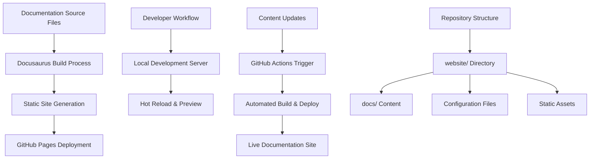

# Design Document

## Overview

This design outlines the complete migration of InvenTag's documentation to a dual-purpose system where the `/docs` directory serves as a single source of truth for both GitHub markdown viewing and Docusaurus-powered documentation site. The solution maintains full GitHub markdown compatibility while providing enhanced web documentation features through Docusaurus.

The approach ensures that developers can view and edit documentation directly on GitHub while users benefit from a modern, searchable documentation website. The `/docs` directory remains the authoritative source, with Docusaurus configured to render these files without modification.

## Architecture

### High-Level Architecture



### Project Structure

The new structure will separate Docusaurus website files from documentation content:

```
inventag-aws/
├── docs/                            # Documentation content (accessible to developers)
│   ├── getting-started/             # Quick start and basics
│   │   ├── introduction.md
│   │   ├── quick-start.md
│   │   └── installation.md
│   ├── user-guides/                 # User-focused documentation
│   │   ├── cli-reference.md
│   │   ├── configuration.md
│   │   ├── production-safety.md
│   │   └── troubleshooting.md
│   ├── architecture/                # Technical architecture docs
│   │   ├── core-integration.md
│   │   ├── state-management.md
│   │   ├── template-framework.md
│   │   └── [other architecture docs]
│   ├── development/                 # Developer resources
│   │   ├── contributing.md
│   │   ├── deployment.md
│   │   ├── security.md
│   │   └── [other dev docs]
│   └── examples/                    # Configuration examples
│       ├── accounts-setup.md
│       ├── cicd-integration.md
│       └── advanced-usage.md
├── website/                         # Docusaurus website configuration
│   ├── static/                      # Static assets for docs
│   │   ├── img/                     # Images and logos
│   │   └── files/                   # Downloadable files
│   ├── src/                         # Custom Docusaurus components/pages
│   │   ├── components/              # React components
│   │   └── pages/                   # Custom pages
│   ├── docusaurus.config.js         # Main Docusaurus configuration
│   ├── sidebars.js                  # Navigation configuration
│   ├── package.json                 # Node.js dependencies for docs
│   └── README.md                    # Documentation setup guide
├── .github/
│   └── workflows/
│       └── docs-deploy.yml          # GitHub Actions workflow
└── [existing project files]
```

## Components and Interfaces

### 1. Docusaurus Configuration

**docusaurus.config.js**
- Site metadata and branding
- Theme configuration
- Plugin configuration (search, analytics)
- Navigation and footer setup
- GitHub Pages deployment settings

**sidebars.js**
- Hierarchical navigation structure
- Category organization
- Auto-generated sidebars for sections
- Cross-references and links

### 2. Content Migration System

**Content Strategy - Single Source of Truth:**
- `README.md` → `docs/index.md` (project overview, GitHub-friendly)
- `QUICKSTART.md` → `docs/getting-started/quick-start.md`
- Current `docs/user-guides/` → `docs/user-guides/` (enhanced with GitHub-compatible frontmatter)
- Current `docs/architecture/` → `docs/architecture/` (enhanced with GitHub-compatible frontmatter)
- Current `docs/development/` → `docs/development/` (enhanced with GitHub-compatible frontmatter)
- `examples/README.md` content → `docs/examples/` (integrated examples)

**Dual Compatibility Approach:**
- All markdown files optimized for both GitHub rendering and Docusaurus
- Frontmatter designed to be invisible on GitHub but functional in Docusaurus
- Relative links work in both GitHub and Docusaurus contexts
- Images and assets accessible from both viewing methods
- No duplication of content - single files serve both purposes

**Link Processing:**
- Convert relative markdown links to Docusaurus routing
- Update internal references to use new paths
- Preserve external links and anchors

### 3. GitHub Actions Workflow

**Trigger Conditions:**
- Push to main branch (documentation changes)
- Manual workflow dispatch
- Optional: Pull request previews

**Build Process:**
1. Checkout repository
2. Setup Node.js environment
3. Install dependencies with caching
4. Optional: Transform markdown files if needed for Docusaurus compatibility
5. Build Docusaurus site from transformed or original files
6. Deploy to GitHub Pages

**Transformation Pipeline (if needed):**
- Automatic link format conversion (GitHub → Docusaurus routing)
- Frontmatter standardization or enhancement
- Asset path adjustments
- Custom markdown syntax translation
- Validation of transformed content

### 4. Development Workflow

**Local Development:**
- `cd website && npm start` - Development server with hot reload
- `cd website && npm run build` - Production build
- `cd website && npm run serve` - Serve production build locally
- Root-level npm scripts for convenience: `npm run docs:start`, `npm run docs:build`

**Single Source Content Management:**
- Markdown files in root-level `docs/` directory with GitHub-compatible frontmatter
- Files viewable and editable directly on GitHub with full formatting
- Same files automatically rendered by Docusaurus with enhanced features
- Asset management in `docs/assets/` directory (accessible to both systems)
- Links and references work in both GitHub and Docusaurus contexts
- No content duplication or synchronization required

## Data Models

### 1. GitHub-Compatible Frontmatter Schema

```yaml
---
title: Page Title
description: Page description for SEO
sidebar_position: 1
---
```

**Design Principles:**
- Minimal frontmatter that doesn't interfere with GitHub rendering
- GitHub ignores YAML frontmatter, showing only content
- Docusaurus uses frontmatter for navigation and SEO
- No visible impact on GitHub markdown display
- Optional fields to maintain clean GitHub presentation

### 2. Navigation Configuration

```javascript
// sidebars.js structure
module.exports = {
  docs: [
    'getting-started/introduction',
    {
      type: 'category',
      label: 'User Guides',
      items: [
        'user-guides/cli-reference',
        'user-guides/configuration',
        // ...
      ],
    },
    // ...
  ],
};
```

### 3. Site Configuration Schema

```javascript
// website/docusaurus.config.js key sections
const config = {
  title: 'InvenTag Documentation',
  tagline: 'Professional AWS Cloud Governance Platform',
  url: 'https://habhabhabs.github.io',
  baseUrl: '/inventag-aws/',
  organizationName: 'habhabhabs',
  projectName: 'inventag-aws',
  presets: [
    [
      'classic',
      {
        docs: {
          path: '../docs',  // Single source of truth
          routeBasePath: '/',
          sidebarPath: require.resolve('./sidebars.js'),
          editUrl: 'https://github.com/habhabhabs/inventag-aws/edit/main/docs/',
          showLastUpdateTime: true,
          showLastUpdateAuthor: true,
        },
        // ...
      },
    ],
  ],
  // ...
};
```

## Error Handling

### 1. Build Failures

**Markdown Processing Errors:**
- Invalid frontmatter format
- Broken internal links
- Missing referenced files
- Invalid MDX syntax

**Mitigation:**
- Pre-build validation scripts
- Link checking during build
- Comprehensive error logging
- Fallback content for missing references

### 2. Deployment Failures

**GitHub Pages Issues:**
- Build timeout
- Asset size limits
- Permission issues
- Branch configuration problems

**Mitigation:**
- Build optimization and caching
- Asset compression
- Clear error reporting
- Automated retry mechanisms

### 3. Content Migration Issues

**Link Preservation:**
- Automated link updating with validation
- Redirect configuration for old paths
- 404 page with search functionality

**Content Integrity:**
- Checksum validation for migrated content
- Automated testing of critical pages
- Content comparison tools

## Testing Strategy

### 1. Build Testing

**Automated Tests:**
- Successful build completion
- Link validation across all pages
- Search functionality testing
- Mobile responsiveness checks

**Local Testing:**
- Development server startup
- Hot reload functionality
- Production build verification

### 2. Dual-Platform Testing

**GitHub Compatibility Testing:**
- Markdown rendering verification on GitHub
- Link functionality in GitHub interface
- Image and asset display on GitHub
- Table of contents and navigation on GitHub

**Docusaurus Functionality Testing:**
- Website rendering from same source files
- Search functionality across all content
- Navigation and sidebar generation
- Mobile responsiveness and performance

**Cross-Platform Validation:**
- Link integrity between both platforms
- Asset accessibility from both contexts
- Content consistency across viewing methods

### 3. Deployment Testing

**CI/CD Pipeline Testing:**
- Workflow trigger validation
- Build process verification
- Deployment success confirmation
- Rollback procedures

**Production Testing:**
- Site accessibility verification
- Performance monitoring
- SEO validation
- Analytics integration

## Implementation Phases

### Phase 1: Docusaurus Setup
- Initialize Docusaurus project in `website/` directory
- Configure Docusaurus to read from root-level `docs/` directory
- Set up development environment with `website/package.json`
- Create convenience scripts in root `package.json` for documentation commands

### Phase 2: Content Migration and Optimization
- Reorganize existing `docs/` content with GitHub-compatible frontmatter
- Update internal links to work in both GitHub and Docusaurus contexts
- Add minimal frontmatter that enhances Docusaurus without affecting GitHub
- Configure navigation and sidebars in `website/sidebars.js`
- Optimize images and assets for dual-platform access
- Test content rendering on both GitHub and Docusaurus

### Phase 3: CI/CD Integration with Optional Transformations
- Create GitHub Actions workflow that builds from `website/` directory
- Add optional markdown transformation step if needed for Docusaurus compatibility
- Configure GitHub Pages deployment with proper build context
- Set up build caching and optimization for `website/` build process
- Implement transformation pipeline for any GitHub → Docusaurus format differences
- Test automated deployment process with transformation validation

### Phase 4: Enhancement, Polish, and Maintenance Documentation
- Add custom styling and branding in `website/src/`
- Implement search functionality
- Add analytics and monitoring
- Create comprehensive maintenance documentation
- Document troubleshooting procedures
- Create contributor guidelines for documentation updates

This design ensures a comprehensive migration that maintains all existing content while providing a modern, maintainable documentation platform that developers can easily work with.
## De
veloper Experience Benefits

### Root Directory Approach Advantages

**Easy Access:**
- Documentation files remain in familiar `docs/` directory structure
- No need to navigate into subdirectories to find documentation
- Direct editing of markdown files without complex project navigation
- Consistent with most open-source project conventions

**Development Workflow:**
- Simple `npm start` from root directory to run documentation server
- Documentation changes immediately visible during development
- No context switching between different project directories
- Familiar file paths for cross-references and linking

**Maintenance Benefits:**
- Single package.json in root for documentation dependencies
- Unified build process for both code and documentation
- Easy integration with existing development workflows
- Simplified CI/CD configuration with single build context

This design ensures that developers can easily access, edit, and maintain documentation while benefiting from Docusaurus's modern features and automated deployment capabilities.## 
Single Source of Truth Benefits

### Dual-Platform Compatibility

**GitHub Native Experience:**
- Full markdown rendering with GitHub's native viewer
- Direct editing through GitHub's web interface
- Pull request reviews show documentation changes clearly
- No additional files or complexity visible to GitHub users
- Standard GitHub markdown features (tables, code blocks, etc.) work perfectly

**Enhanced Web Experience:**
- Modern documentation site with search functionality
- Responsive design for all devices
- Advanced navigation and categorization
- SEO optimization and analytics
- Interactive features and custom components

**Developer Workflow Advantages:**
- Single file to edit for any documentation change
- No synchronization between different documentation systems
- Changes immediately visible on both GitHub and documentation site
- Familiar markdown editing experience
- No learning curve for new documentation tools

**Maintenance Benefits:**
- Zero content duplication
- No risk of documentation getting out of sync
- Single approval process for documentation changes
- Consistent formatting and style across platforms
- Reduced maintenance overhead

### Link Strategy for Dual Compatibility

**Relative Links:**
- Use relative paths that work in both GitHub and Docusaurus
- Example: `[CLI Guide](user-guides/cli-reference.md)` works in both contexts
- Avoid absolute paths or platform-specific routing

**Asset References:**
- Store images in `docs/assets/` directory
- Use relative paths: ``
- Both platforms can access the same asset files

**Cross-References:**
- Maintain consistent file naming and directory structure
- Use descriptive filenames that work as both GitHub files and Docusaurus routes
- Ensure all internal links resolve correctly on both platforms

This approach ensures that the documentation serves both casual GitHub browsers and users seeking comprehensive documentation, all from a single, authoritative source.##
 CI/CD Transformation Strategy

### Intelligent Content Processing

**Conditional Transformations:**
- CI/CD pipeline detects if transformations are needed
- If markdown is fully compatible, files are used directly
- If transformations are required, automated processing handles conversions
- Transformations are applied only during build, preserving source files

**Potential Transformation Scenarios:**
- Link format differences between GitHub and Docusaurus
- Frontmatter enhancements for Docusaurus features
- Asset path adjustments for different base URLs
- Custom markdown extensions or syntax differences
- Table of contents generation or modification

**Pipeline Benefits:**
- Source files remain GitHub-optimized and human-readable
- Docusaurus gets optimally formatted content
- No manual intervention required for format differences
- Automatic validation ensures both platforms work correctly
- Future format changes can be handled through pipeline updates

**Fallback Strategy:**
- If transformations fail, pipeline falls back to direct file usage
- Error reporting for transformation issues
- Manual override capability for specific files
- Comprehensive logging for debugging transformation problems

This approach ensures maximum flexibility while maintaining the single source of truth principle, allowing the documentation to evolve with both platform requirements over time.## 
Maintenance Documentation Strategy

### Developer Maintenance Guide

**Documentation Structure Management:**
```markdown
# Documentation Maintenance Guide

## Adding New Documentation
1. Create markdown file in appropriate `/docs` subdirectory
2. Add minimal frontmatter for Docusaurus navigation
3. Use relative links for cross-references
4. Test on both GitHub and local Docusaurus server

## Updating Navigation
1. Edit `website/sidebars.js` to add new pages
2. Use descriptive labels and logical grouping
3. Test navigation on development server
4. Verify GitHub directory browsing still works

## Asset Management
1. Place images in `docs/assets/` directory
2. Use relative paths: ``
3. Optimize images for web viewing
4. Ensure assets work in both GitHub and Docusaurus
```

**Troubleshooting Documentation:**
```markdown
# Troubleshooting Guide

## Common Issues

### Build Failures
- Check Node.js version compatibility
- Verify all markdown files have valid frontmatter
- Ensure all internal links are valid
- Check for special characters in filenames

### Link Issues
- Use relative paths consistently
- Avoid absolute URLs for internal content
- Test links in both GitHub and Docusaurus
- Check for case sensitivity in file paths

### Deployment Problems
- Verify GitHub Pages settings
- Check GitHub Actions workflow logs
- Ensure base URL configuration is correct
- Validate repository permissions
```

**Contributor Guidelines:**
```markdown
# Documentation Contribution Guidelines

## Writing Standards
- Use clear, concise language
- Include code examples where appropriate
- Add frontmatter for proper categorization
- Test content on both platforms before submitting

## Review Process
1. Create pull request with documentation changes
2. Verify GitHub markdown rendering
3. Check Docusaurus preview (if available)
4. Ensure all links work correctly
5. Get approval from maintainers

## Best Practices
- Keep filenames descriptive and URL-friendly
- Use consistent heading structure
- Include table of contents for long documents
- Cross-reference related documentation
```

### Maintenance Automation

**Automated Checks:**
- Link validation in CI/CD pipeline
- Markdown linting and formatting
- Frontmatter validation
- Asset reference verification
- Cross-platform rendering tests

**Monitoring and Alerts:**
- Build failure notifications
- Broken link detection
- Performance monitoring for documentation site
- Analytics for documentation usage patterns

**Update Procedures:**
```markdown
# Regular Maintenance Tasks

## Weekly
- Review analytics for popular/unpopular content
- Check for broken external links
- Monitor build performance and times

## Monthly
- Update dependencies in website/package.json
- Review and update outdated content
- Check for new Docusaurus features or improvements

## Quarterly
- Comprehensive link audit
- Documentation structure review
- User feedback analysis and improvements
- Performance optimization review
```

### Version Management

**Documentation Versioning:**
- Use Git tags for documentation releases
- Maintain changelog for documentation updates
- Consider Docusaurus versioning for major releases
- Archive old documentation versions if needed

**Dependency Management:**
- Keep Docusaurus and plugins updated
- Test updates in development environment
- Document any breaking changes or migration steps
- Maintain compatibility with GitHub markdown rendering

This comprehensive maintenance strategy ensures the documentation system remains healthy, up-to-date, and easy to contribute to over time.