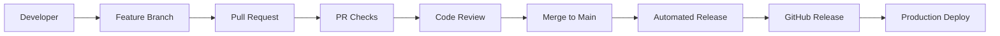

# 🏷️ AWS InvenTag

> **Python tool to check on AWS cloud inventory and tagging. Integrate into your CI/CD flow to meet your organization's stringent compliance requirements.**

[](https://github.com/habhabhabs/aws-inventag/actions)
[](https://github.com/habhabhabs/aws-inventag/actions)
[](https://www.python.org/downloads/)
[](https://opensource.org/licenses/MIT)
[](https://aws.amazon.com/)
[](https://github.com/habhabhabs/aws-inventag/releases/latest)

## 🎯 Overview

**AWS InvenTag** is a comprehensive Python toolkit for AWS resource inventory management and tag compliance checking. Designed for enterprise environments, it automates the discovery, analysis, and reporting of AWS resources while ensuring adherence to organizational tagging policies.

### ✨ Key Features

- 🔍 **Multi-Method Discovery** - Leverages ResourceGroupsTaggingAPI, AWSConfig, and service-specific APIs
- 📊 **Professional BOM Generation** - Creates detailed Excel/CSV reports with service-specific sheets
- 🏷️ **Tag Compliance Checking** - Validates resources against organizational tagging policies
- 🔧 **Intelligent Data Enhancement** - Enriches resources with VPC names, account IDs, and inferred tags
- 🚀 **CI/CD Ready** - Easy integration into automated compliance workflows
- 📈 **Comprehensive Reporting** - Summary dashboards with compliance percentages and service breakdowns

## 📁 Project Structure

```
aws-inventag/
├── README.md                    # This file - main documentation
├── requirements.txt             # Python dependencies
├── scripts/                     # Main tools
│   ├── aws_resource_inventory.py      # Resource discovery
│   ├── tag_compliance_checker.py      # Tag validation  
│   ├── bom_converter.py               # Excel/CSV generator
│   └── README.md                      # Script documentation
├── config/                      # Configuration files
│   ├── iam-policy-read-only.json      # Required IAM permissions
│   ├── tag_policy_example.yaml        # Example tag policy
│   ├── tag_policy_example.json        # Example tag policy (JSON)
│   └── README.md                      # Config documentation
├── docs/                        # Detailed documentation
│   └── SECURITY.md                    # Security guide & permissions
└── examples/                    # Examples and outputs
    ├── quick_start.sh                 # Automated demo script
    └── README.md                      # Usage examples
```

## 🚀 Quick Start

### 1. Install Dependencies
```bash
pip install -r requirements.txt
```

### 2. Configure AWS Credentials
```bash
aws configure
# OR set environment variables: AWS_ACCESS_KEY_ID, AWS_SECRET_ACCESS_KEY
```

### 3. Set Up Permissions
```bash
aws iam create-policy --policy-name AWSResourceInventoryReadOnly --policy-document file://config/iam-policy-read-only.json
aws iam attach-user-policy --user-name YOUR_USER --policy-arn arn:aws:iam::ACCOUNT:policy/AWSResourceInventoryReadOnly
```

### 4. Run the Demo
```bash
./examples/quick_start.sh
```

**Or run tools individually:**
```bash
# Basic resource inventory
python scripts/aws_resource_inventory.py

# Tag compliance check
python scripts/tag_compliance_checker.py --config config/tag_policy_example.yaml

# Convert to Excel with service sheets
python scripts/bom_converter.py --input examples/basic_inventory_*.json --output examples/report.xlsx
```

## 🔄 CI/CD Integration & Automated Releases

### Automated Semantic Versioning

This repository uses **automated semantic versioning** with every merge to main:

- 🏷️ **Label your PRs** to control version bumps:
  - `release:patch` → v1.0.0 → v1.0.1 (bug fixes, minor updates)  
  - `release:minor` → v1.0.0 → v1.1.0 (new features, backwards compatible)
  - `release:major` → v1.0.0 → v2.0.0 (breaking changes)
- 🚀 **Automatic releases** created on every merge to main
- 📦 **Release assets** include source archives and comprehensive changelog
- ✅ **Quality gates** ensure tests pass before release

### Contributing with Automated Releases

1. **Create a feature branch:**
   ```bash
   git checkout -b feat/new-export-format
   git commit -m "feat: add JSON export format for compliance reports"
   ```

2. **Create PR with appropriate release label:**
   ```bash
   # For new features (minor version bump)
   gh pr create --title "feat: add JSON export format" --label "release:minor"
   
   # For bug fixes (patch version bump - default)
   gh pr create --title "fix: resolve Excel formatting issue"
   
   # For breaking changes (major version bump)
   gh pr create --title "feat!: redesign CLI interface" --label "release:major"
   ```

3. **Merge to main** → Automatic release triggered! 🎉

### Manual Releases

**Via GitHub Actions UI:**
1. Go to Actions → "Automated Release"
2. Click "Run workflow" 
3. Select version bump type
4. Click "Run workflow"

**Via Command Line:**
```bash
# Trigger specific version bumps
gh workflow run "Automated Release" --field version_bump=patch
gh workflow run "Automated Release" --field version_bump=minor  
gh workflow run "Automated Release" --field version_bump=major
```

### CI/CD Pipeline Features

- ✅ **Automated Testing**: Python syntax, formatting, and functionality tests
- 🔍 **PR Validation**: Title format, description length, release labels
- 📝 **Conventional Commits**: Enhanced release notes from commit messages
- 🏷️ **Breaking Change Detection**: Requires proper labeling for major releases
- 📊 **Release Analytics**: Track version history and change patterns

### Integration Examples

**GitHub Actions Workflow:**
```yaml
name: Compliance Check
on: [push, pull_request]
jobs:
  compliance:
    runs-on: ubuntu-latest
    steps:
    - uses: actions/checkout@v4
    - name: Setup Python
      uses: actions/setup-python@v4
      with:
        python-version: '3.10'
    - name: Install dependencies
      run: pip install -r requirements.txt
    - name: Check tag compliance
      run: python scripts/tag_compliance_checker.py --config config/production_tags.yaml
      env:
        AWS_ACCESS_KEY_ID: ${{ secrets.AWS_ACCESS_KEY_ID }}
        AWS_SECRET_ACCESS_KEY: ${{ secrets.AWS_SECRET_ACCESS_KEY }}
```

**Scheduled Compliance Monitoring:**
```yaml
name: Daily Compliance Report
on:
  schedule:
    - cron: '0 9 * * *'  # Daily at 9 AM UTC
jobs:
  compliance:
    runs-on: ubuntu-latest
    steps:
    - uses: actions/checkout@v4
    - name: Generate compliance report
      run: |
        python scripts/tag_compliance_checker.py \
          --config config/production_tags.yaml \
          --s3-bucket compliance-reports \
          --s3-key daily-reports/compliance-$(date +%Y%m%d).json
```

### Version Management

**Current Version Tracking:**
- Version stored in `version.json` 
- Automatic updates on each release
- Semantic versioning (MAJOR.MINOR.PATCH)

**Release Documentation:**
- 📖 See [`RELEASE.md`](RELEASE.md) for complete release management guide
- 🔗 [Latest Release](https://github.com/habhabhabs/aws-inventag/releases/latest)
- 📊 [All Releases](https://github.com/habhabhabs/aws-inventag/releases)

## 📋 Main Tools

### 🔍 **Resource Inventory** (`scripts/aws_resource_inventory.py`)
Discovers ALL AWS resources across your account.

```bash
# Discover all resources in all regions
python scripts/aws_resource_inventory.py

# Export to Excel automatically  
python scripts/aws_resource_inventory.py --export-excel

# Upload to S3
python scripts/aws_resource_inventory.py --s3-bucket my-reports-bucket
```

### 🏷️ **Tag Compliance** (`scripts/tag_compliance_checker.py`)
Validates ALL resources against your tagging policies.

```bash
# Check for untagged resources only
python scripts/tag_compliance_checker.py

# Use your tagging policy
python scripts/tag_compliance_checker.py --config config/tag_policy_example.yaml

# Get compliance report with S3 upload
python scripts/tag_compliance_checker.py --config my_policy.yaml --s3-bucket compliance-reports
```

### 📊 **BOM Converter** (`scripts/bom_converter.py`)
Converts JSON/YAML to professional Excel reports.

```bash
# Create Excel with service-specific sheets
python scripts/bom_converter.py --input inventory.json --output report.xlsx

# Create CSV with service column
python scripts/bom_converter.py --input inventory.json --output report.csv --format csv
```

## 🏷️ Tag Policy Configuration

Create your own tag policy by copying and editing the example:

```bash
cp config/tag_policy_example.yaml my_tag_policy.yaml
# Edit my_tag_policy.yaml with your requirements
```

**Example policy structure:**
```yaml
required_tags:
  - "Environment"      # Any value allowed
  - "Owner"
  - "Project" 
  
  # Specific allowed values
  - key: "Environment"
    allowed_values: ["production", "staging", "development"]
  
  - key: "CostCenter"
    required_values: ["engineering", "marketing", "finance"]
```

## 📊 Excel Output Features

- **Service-Specific Sheets**: Each AWS service gets its own sheet (EC2, S3, RDS, etc.)
- **VPC/Subnet Names**: Automatic lookup and inclusion from resource tags
- **Professional Formatting**: Color-coded headers, auto-sized columns
- **Summary Dashboard**: Overview with service breakdown and statistics

## 🔐 Security

**✅ 100% READ-ONLY**: Cannot modify your AWS infrastructure  
**✅ MINIMAL PERMISSIONS**: Only requires read access to AWS services  
**✅ PRODUCTION SAFE**: Designed for safe execution in production environments

See [`docs/SECURITY.md`](docs/SECURITY.md) for detailed security information.

## 🌍 Region Handling

- **Default**: Scans ALL AWS regions automatically
- **Fallback**: Uses us-east-1 and ap-southeast-1 if region discovery fails
- **Custom**: Specify specific regions with `--regions us-east-1 eu-west-1`

## ⚡ Common Use Cases

### Monthly Resource Audit
```bash
python scripts/aws_resource_inventory.py --export-excel --s3-bucket monthly-reports
```

### Tag Compliance Monitoring
```bash
python scripts/tag_compliance_checker.py --config config/production_tags.yaml --s3-bucket compliance-reports
```

### Cost Center Reporting
```bash
python scripts/aws_resource_inventory.py
python scripts/bom_converter.py --input aws_resources_*.json --output cost_center_report.xlsx
```

### Security Audit Preparation
```bash
python scripts/tag_compliance_checker.py --config config/security_tags.yaml --verbose
```

## 🛠️ Advanced Options

### Resource Inventory
- `--regions us-east-1 eu-west-1` - Scan specific regions only
- `--format yaml` - Output in YAML format
- `--s3-bucket BUCKET --s3-key path/file.json` - Custom S3 upload
- `--export-excel` - Auto-generate Excel report
- `--verbose` - Detailed logging

### Tag Compliance
- `--config FILE` - Use custom tag policy
- `--regions LIST` - Check specific regions
- `--format yaml` - YAML output format
- `--s3-bucket BUCKET` - Upload compliance report
- `--verbose` - Show detailed progress

### BOM Converter
- `--format csv` - Export as CSV instead of Excel
- `--no-vpc-enrichment` - Skip VPC/subnet name lookup (faster)

## 📦 Dependencies

- **boto3** - AWS SDK
- **PyYAML** - YAML support
- **openpyxl** - Excel generation
- **colorama** - Colored output

## 🆘 Troubleshooting

**"No credentials found"**  
→ Run `aws configure` or set environment variables

**"Access denied for service X"**  
→ Update IAM policy with permissions for that service

**"No resources found"**  
→ Check if you have any resources in the scanned regions

**Excel export fails**  
→ Install openpyxl: `pip install openpyxl`

## 📁 Output Files

All files include timestamps for easy tracking:
- `aws_resources_YYYYMMDD_HHMMSS.json` - Complete inventory
- `aws_resources_YYYYMMDD_HHMMSS.xlsx` - Excel with service sheets
- `tag_compliance_report_YYYYMMDD_HHMMSS.json` - Compliance results

## 🏢 Enterprise Features

- **Multi-account support** via cross-account roles
- **Automated scheduling** via AWS Lambda or cron
- **Integration** with CMDB/ITSM systems via S3 uploads
- **Compliance reporting** for SOC2, PCI-DSS, HIPAA audits
- **Cost optimization** through resource discovery and tagging

---

## 📚 Documentation

- **[Release Management Guide](RELEASE.md)** - Complete CI/CD and versioning documentation
- **[Security Guide](docs/SECURITY.md)** - Detailed permissions and security info
- **[Configuration Guide](config/README.md)** - Tag policies and IAM setup
- **[Script Documentation](scripts/README.md)** - Detailed script usage
- **[Examples](examples/README.md)** - Usage patterns and outputs

## 🚀 DevOps & Production Integration

### Enterprise CI/CD Pipeline

This repository demonstrates modern DevOps practices:



### Monitoring & Observability

**Compliance Metrics:**
- Track compliance percentage over time
- Service-specific compliance trends  
- Tag policy violation alerts
- Resource growth patterns

**Integration with Monitoring:**
```bash
# Export compliance metrics to monitoring system
python scripts/tag_compliance_checker.py \
  --config production_tags.yaml \
  --format json | \
  jq '.summary.compliance_percentage' | \
  curl -X POST monitoring-endpoint
```

### Production Deployment Patterns

**1. Scheduled Compliance Auditing:**
```yaml
# Deploy as AWS Lambda for automated daily reports
name: Deploy Compliance Lambda
on:
  release:
    types: [published]
jobs:
  deploy:
    runs-on: ubuntu-latest
    steps:
    - name: Deploy to AWS Lambda
      run: |
        zip -r aws-inventag.zip scripts/ config/ requirements.txt
        aws lambda update-function-code \
          --function-name compliance-checker \
          --zip-file fileb://aws-inventag.zip
```

**2. Multi-Account Scanning:**
```bash
# Cross-account compliance checking
for account in prod staging dev; do
  aws sts assume-role --role-arn arn:aws:iam::${account}:role/ComplianceRole \
    --role-session-name compliance-scan \
    --query 'Credentials.[AccessKeyId,SecretAccessKey,SessionToken]' \
    --output text | read key secret token
  
  AWS_ACCESS_KEY_ID=$key \
  AWS_SECRET_ACCESS_KEY=$secret \
  AWS_SESSION_TOKEN=$token \
  python scripts/tag_compliance_checker.py \
    --config config/${account}_tags.yaml \
    --output ${account}_compliance.json
done
```

**3. Integration with ITSM/CMDB:**
```bash
# Upload to ServiceNow/JIRA for ticket creation
python scripts/tag_compliance_checker.py \
  --config production_tags.yaml | \
  jq '.non_compliant_resources[] | select(.resource.service=="EC2")' | \
  curl -X POST -H "Content-Type: application/json" \
    -d @- https://company.service-now.com/api/compliance-violations
```

### Cost Optimization Integration

**Resource Cost Analysis:**
```bash
# Combine with AWS Cost Explorer
python scripts/aws_resource_inventory.py --export-excel
# Import into cost analysis tools for optimization recommendations
```

**Tag-Based Cost Allocation:**
```bash
# Generate cost center reports
python scripts/tag_compliance_checker.py \
  --config cost_center_tags.yaml \
  --output cost_allocation_report.json
```

### Security & Compliance

**SOC2/ISO27001 Integration:**
- Automated evidence collection
- Continuous compliance monitoring  
- Audit trail generation
- Policy violation alerts

**Zero-Trust Security Model:**
- Read-only permissions only
- Cross-account role assumption
- Temporary credential usage
- Audit logging enabled

**Quick help:** Run `./examples/quick_start.sh` for an automated demo of all features!