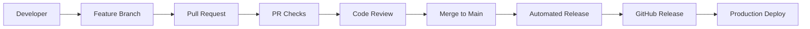

# 🏷️ InvenTag

> **Python tool to check on AWS™ cloud inventory and tagging. Integrate into your CI/CD flow to meet your organization's stringent compliance requirements.**

[](https://github.com/habhabhabs/inventag-aws/actions)
[](https://github.com/habhabhabs/inventag-aws/actions)
[](https://www.python.org/downloads/)
[](https://opensource.org/licenses/MIT)
[](https://aws.amazon.com/)
[](https://github.com/habhabhabs/inventag-aws/releases/latest)

## 🎯 Overview

**InvenTag** is a comprehensive Python toolkit for AWS™ resource inventory management and tag compliance checking. Designed for enterprise environments, it automates the discovery, analysis, and reporting of AWS™ resources while ensuring adherence to organizational tagging policies.

> **Disclaimer**: AWS™ is a trademark of Amazon Web Services, Inc. InvenTag is an independent tool and is not affiliated with, endorsed by, or sponsored by Amazon Web Services, Inc.

### ✨ Key Features

- 🔍 **Multi-Method Discovery** - Leverages ResourceGroupsTaggingAPI, AWSConfig, and service-specific APIs
- 🎯 **Service-Specific Enrichment** - Deep attribute extraction for S3, RDS, EC2, Lambda, ECS, EKS and more
- 📊 **Professional BOM Generation** - Creates detailed Excel/CSV reports with service-specific sheets
- 🏷️ **Tag Compliance Checking** - Validates resources against organizational tagging policies
- 🔧 **Intelligent Data Enhancement** - Enriches resources with VPC names, account IDs, and inferred tags
- 🌐 **Network Analysis** - Comprehensive VPC/subnet analysis with IP utilization and capacity planning
- 🔒 **Security Analysis** - Security posture assessment with vulnerability detection and compliance checks
- 🚀 **CI/CD Ready** - Easy integration into automated compliance workflows
- 📈 **Comprehensive Reporting** - Summary dashboards with compliance percentages and service breakdowns
- 🔄 **State Management** - Track changes over time with persistent state storage and versioning
- 🎯 **Delta Detection** - Advanced change analysis with impact assessment and categorization
- 📝 **Changelog Generation** - Professional change reports for audit trails and documentation

## 📁 Project Structure

```
inventag-aws/
├── README.md                    # This file - main documentation
├── requirements.txt             # Python dependencies
├── inventag/                    # Unified Python package
│   ├── __init__.py                    # Package initialization
│   ├── discovery/                     # Resource discovery module
│   │   ├── __init__.py
│   │   ├── inventory.py               # AWSResourceInventory class
│   │   ├── service_enrichment.py      # Service attribute enrichment framework
│   │   ├── service_handlers.py        # Specific AWS service handlers
│   │   ├── network_analyzer.py        # NetworkAnalyzer for VPC/subnet analysis
│   │   └── security_analyzer.py       # SecurityAnalyzer for security posture
│   ├── compliance/                    # Tag compliance module
│   │   ├── __init__.py
│   │   └── checker.py                 # ComprehensiveTagComplianceChecker
│   ├── reporting/                     # BOM generation module
│   │   ├── __init__.py
│   │   └── converter.py               # BOMConverter class
│   └── state/                         # State management module
│       ├── __init__.py
│       ├── state_manager.py           # StateManager for persistence
│       ├── delta_detector.py          # DeltaDetector for change tracking
│       └── changelog_generator.py     # ChangelogGenerator for reports
├── scripts/                     # CLI wrapper scripts
│   ├── aws_resource_inventory.py      # Resource discovery CLI
│   ├── tag_compliance_checker.py      # Tag validation CLI
│   ├── bom_converter.py               # Excel/CSV generator CLI
│   └── README.md                      # Script documentation
├── config/                      # Configuration files
│   ├── iam-policy-read-only.json      # Required IAM permissions
│   ├── tag_policy_example.yaml        # Example tag policy
│   ├── tag_policy_example.json        # Example tag policy (JSON)
│   └── README.md                      # Config documentation
├── docs/                        # Detailed documentation
│   └── SECURITY.md                    # Security guide & permissions
├── examples/                    # Examples and demo scripts
│   ├── quick_start.sh                 # Automated demo script
│   ├── state_manager_demo.py          # State management demo
│   ├── delta_detector_demo.py         # Change tracking demo
│   ├── changelog_generator_demo.py    # Changelog generation demo
│   └── README.md                      # Usage examples
└── tests/                       # Comprehensive test suite
    ├── unit/                          # Unit tests for all modules
    ├── integration/                   # End-to-end workflow tests
    ├── backward_compatibility/        # Legacy compatibility tests
    └── README.md                      # Testing documentation
```

## 🚀 Quick Start

### 1. Install Dependencies
```bash
pip install -r requirements.txt
```

### 2. Configure AWS Credentials
```bash
aws configure
# OR set environment variables: AWS_ACCESS_KEY_ID, AWS_SECRET_ACCESS_KEY
```

### 3. Set Up Permissions
```bash
aws iam create-policy --policy-name AWSResourceInventoryReadOnly --policy-document file://config/iam-policy-read-only.json
aws iam attach-user-policy --user-name YOUR_USER --policy-arn arn:aws:iam::ACCOUNT:policy/AWSResourceInventoryReadOnly
```

### 4. Run the Demo
```bash
./examples/quick_start.sh
```

**Or run tools individually:**
```bash
# Basic resource inventory
python scripts/aws_resource_inventory.py

# Tag compliance check
python scripts/tag_compliance_checker.py --config config/tag_policy_example.yaml

# Convert to Excel with service sheets
python scripts/bom_converter.py --input examples/basic_inventory_*.json --output examples/report.xlsx
```

## 🔄 CI/CD Integration & Automated Releases

### Automated Semantic Versioning

This repository uses **automated semantic versioning** with every merge to main:

- 🏷️ **Label your PRs** to control version bumps:
  - `release:patch` → v1.0.0 → v1.0.1 (bug fixes, minor updates)  
  - `release:minor` → v1.0.0 → v1.1.0 (new features, backwards compatible)
  - `release:major` → v1.0.0 → v2.0.0 (breaking changes)
- 🚀 **Automatic releases** created on every merge to main
- 📦 **Release assets** include source archives and comprehensive changelog
- ✅ **Quality gates** ensure tests pass before release

### Contributing with Automated Releases

1. **Create a feature branch:**
   ```bash
   git checkout -b feat/new-export-format
   git commit -m "feat: add JSON export format for compliance reports"
   ```

2. **Create PR with appropriate release label:**
   ```bash
   # For new features (minor version bump)
   gh pr create --title "feat: add JSON export format" --label "release:minor"
   
   # For bug fixes (patch version bump - default)
   gh pr create --title "fix: resolve Excel formatting issue"
   
   # For breaking changes (major version bump)
   gh pr create --title "feat!: redesign CLI interface" --label "release:major"
   ```

3. **Merge to main** → Automatic release triggered! 🎉

### Manual Releases

**Via GitHub Actions UI:**
1. Go to Actions → "Automated Release"
2. Click "Run workflow" 
3. Select version bump type
4. Click "Run workflow"

**Via Command Line:**
```bash
# Trigger specific version bumps
gh workflow run "Automated Release" --field version_bump=patch
gh workflow run "Automated Release" --field version_bump=minor  
gh workflow run "Automated Release" --field version_bump=major
```

### CI/CD Pipeline Features

- ✅ **Automated Testing**: Python syntax, formatting, and functionality tests
- 🔍 **PR Validation**: Title format, description length, release labels
- 📝 **Conventional Commits**: Enhanced release notes from commit messages
- 🏷️ **Breaking Change Detection**: Requires proper labeling for major releases
- 📊 **Release Analytics**: Track version history and change patterns

### Integration Examples

**GitHub Actions Workflow:**
```yaml
name: Compliance Check
on: [push, pull_request]
jobs:
  compliance:
    runs-on: ubuntu-latest
    steps:
    - uses: actions/checkout@v4
    - name: Setup Python
      uses: actions/setup-python@v4
      with:
        python-version: '3.10'
    - name: Install dependencies
      run: pip install -r requirements.txt
    - name: Check tag compliance
      run: python scripts/tag_compliance_checker.py --config config/production_tags.yaml
      env:
        AWS_ACCESS_KEY_ID: ${{ secrets.AWS_ACCESS_KEY_ID }}
        AWS_SECRET_ACCESS_KEY: ${{ secrets.AWS_SECRET_ACCESS_KEY }}
```

**Scheduled Compliance Monitoring:**
```yaml
name: Daily Compliance Report
on:
  schedule:
    - cron: '0 9 * * *'  # Daily at 9 AM UTC
jobs:
  compliance:
    runs-on: ubuntu-latest
    steps:
    - uses: actions/checkout@v4
    - name: Generate compliance report
      run: |
        python scripts/tag_compliance_checker.py \
          --config config/production_tags.yaml \
          --s3-bucket compliance-reports \
          --s3-key daily-reports/compliance-$(date +%Y%m%d).json
```

### Version Management

**Current Version Tracking:**
- Version stored in `version.json` 
- Automatic updates on each release
- Semantic versioning (MAJOR.MINOR.PATCH)

**Release Documentation:**
- 📖 See [`RELEASE.md`](RELEASE.md) for complete release management guide
- 🔗 [Latest Release](https://github.com/habhabhabs/inventag-aws/releases/latest)
- 📊 [All Releases](https://github.com/habhabhabs/inventag-aws/releases)

## 📋 Main Tools

### 🔍 **Resource Inventory** (`scripts/aws_resource_inventory.py`)
Discovers ALL AWS resources across your account.

```bash
# Discover all resources in all regions
python scripts/aws_resource_inventory.py

# Export to Excel automatically  
python scripts/aws_resource_inventory.py --export-excel

# Upload to S3
python scripts/aws_resource_inventory.py --s3-bucket my-reports-bucket
```

### 🏷️ **Tag Compliance** (`scripts/tag_compliance_checker.py`)
Validates ALL resources against your tagging policies.

```bash
# Check for untagged resources only
python scripts/tag_compliance_checker.py

# Use your tagging policy
python scripts/tag_compliance_checker.py --config config/tag_policy_example.yaml

# Get compliance report with S3 upload
python scripts/tag_compliance_checker.py --config my_policy.yaml --s3-bucket compliance-reports
```

### 📊 **BOM Converter** (`scripts/bom_converter.py`)
Converts JSON/YAML to professional Excel reports.

```bash
# Create Excel with service-specific sheets
python scripts/bom_converter.py --input inventory.json --output report.xlsx

# Create CSV with service column
python scripts/bom_converter.py --input inventory.json --output report.csv --format csv
```

## 🔄 State Management & Change Tracking

InvenTag now includes powerful state management capabilities for tracking changes over time and generating comprehensive change reports.

### 📈 **State Manager**
Persistent storage and versioning of inventory states with comprehensive metadata tracking.

```python
from inventag.state import StateManager

# Initialize state manager
state_manager = StateManager(
    state_dir="inventory_states",
    retention_days=30,
    max_snapshots=10
)

# Save current state
state_id = state_manager.save_state(
    resources=discovered_resources,
    account_id="123456789012",
    regions=["us-east-1", "us-west-2"],
    discovery_method="comprehensive",
    compliance_data=compliance_results
)

# Load previous state for comparison
previous_state = state_manager.load_state(state_id)
```

### 🔍 **Delta Detection**
Advanced change detection with comprehensive analysis of resource modifications.

```python
from inventag.state import DeltaDetector

# Initialize delta detector
detector = DeltaDetector()

# Detect changes between states
delta_report = detector.detect_changes(
    old_resources=previous_resources,
    new_resources=current_resources,
    state1_id='20231201_120000',
    state2_id='20231201_130000'
)

# Analyze results
print(f"Added: {len(delta_report.added_resources)}")
print(f"Removed: {len(delta_report.removed_resources)}")
print(f"Modified: {len(delta_report.modified_resources)}")
```

### 📝 **Changelog Generation**
Professional change reports with detailed analysis and impact assessment.

```python
from inventag.state import ChangelogGenerator

# Generate comprehensive changelog
generator = ChangelogGenerator()
changelog = generator.generate_changelog(
    delta_report=delta_report,
    format='markdown',
    include_details=True
)

# Export changelog
generator.export_changelog(changelog, 'changes_report.md')
```

### 🎯 **Demo Scripts**
Explore the comprehensive capabilities with interactive demos:

```bash
# State management demonstration
python examples/state_manager_demo.py

# Change detection demonstration  
python examples/delta_detector_demo.py

# Changelog generation demonstration
python examples/changelog_generator_demo.py

# Service enrichment demonstration
python examples/service_enrichment_demo.py

# Network analysis demonstration
python examples/network_security_analysis_demo.py
```

### 🔧 **Key State Management Features**

- **📊 Comprehensive Metadata**: Track discovery method, regions, compliance status, and custom tags
- **🔒 Data Integrity**: Checksum validation and state integrity verification
- **⏰ Retention Policies**: Configurable retention by age and count limits
- **📈 Change Analytics**: Detailed analysis of compliance, security, and network changes
- **🎯 Impact Assessment**: Identify high-impact changes and cascade risks
- **📋 Export Capabilities**: JSON, YAML, CSV export for CI/CD integration
- **🔍 Query Interface**: List, compare, and validate states programmatically

## 🌐 Network Analysis & Capacity Planning

InvenTag includes a comprehensive NetworkAnalyzer that provides deep VPC and subnet analysis for network visibility, capacity planning, and optimization recommendations.

### 🔧 **Network Analysis Features**

#### **VPC Analysis** - Comprehensive Virtual Private Cloud Assessment
- **CIDR Block Analysis**: Multi-CIDR support with total IP calculations
- **Utilization Metrics**: Real-time IP utilization across all subnets
- **Network Components**: Internet gateways, NAT gateways, VPC endpoints
- **Connectivity Mapping**: VPC peering and Transit Gateway attachments
- **Resource Association**: Automatic mapping of resources to VPCs

#### **Subnet Analysis** - Detailed Subnet Utilization and Planning
- **IP Utilization Tracking**: Available vs. used IP addresses with percentages
- **Availability Zone Distribution**: Multi-AZ subnet analysis
- **Public/Private Classification**: Route table analysis for subnet types
- **Capacity Planning**: Utilization thresholds and growth projections
- **Resource Mapping**: EC2, RDS, Lambda resource-to-subnet associations

#### **Network Optimization** - Intelligent Recommendations
- **Capacity Warnings**: High utilization alerts (configurable thresholds)
- **Underutilized Resources**: Identification of unused VPCs and subnets
- **Consolidation Opportunities**: Subnet optimization recommendations
- **Cost Optimization**: NAT gateway and VPC endpoint suggestions

### 🛠️ **Network Analysis Framework**

```python
from inventag.discovery.network_analyzer import NetworkAnalyzer

# Initialize network analyzer
analyzer = NetworkAnalyzer()

# Analyze VPC resources with comprehensive metrics
vpc_analysis = analyzer.analyze_vpc_resources(resources)

# Generate network capacity summary
network_summary = analyzer.generate_network_summary(vpc_analysis)

# Map resources to network context
enriched_resources = analyzer.map_resources_to_network(resources)

print(f"Total VPCs: {network_summary.total_vpcs}")
print(f"Total Available IPs: {network_summary.total_available_ips}")
print(f"Highest Utilization: {network_summary.highest_utilization_percentage:.1f}%")
```

### 🎯 **Network Analysis Use Cases**

#### **Capacity Planning**
```python
# Identify high-utilization subnets
for vpc_id, vpc in vpc_analysis.items():
    for subnet in vpc.subnets:
        if subnet.utilization_percentage > 80:
            print(f"WARNING: Subnet {subnet.subnet_name} is {subnet.utilization_percentage:.1f}% utilized")
```

#### **Cost Optimization**
```python
# Find unused VPCs for cost savings
unused_vpcs = [vpc for vpc in vpc_analysis.values() if not vpc.associated_resources]
print(f"Found {len(unused_vpcs)} unused VPCs that could be removed")
```

#### **Network Security Assessment**
```python
# Identify public subnets and their resources
for vpc in vpc_analysis.values():
    public_subnets = [s for s in vpc.subnets if s.is_public]
    if public_subnets:
        print(f"VPC {vpc.vpc_name} has {len(public_subnets)} public subnets")
```

## 🎯 Service-Specific Enrichment

InvenTag includes a powerful service enrichment framework that provides deep attribute extraction for major AWS services, going beyond basic resource discovery to capture detailed configuration and operational data.

### 🔧 **Supported Services with Deep Enrichment**

#### **Amazon S3** - Comprehensive Bucket Analysis
- **Encryption Configuration**: Server-side encryption settings, KMS key details
- **Versioning Status**: Bucket versioning configuration
- **Lifecycle Management**: Lifecycle rules and policies
- **Public Access Controls**: Public access block configuration
- **Object Lock**: Object lock configuration and retention policies
- **Location Constraints**: Bucket region and location details

#### **Amazon RDS** - Database Configuration Deep Dive
- **Engine Details**: Database engine, version, and class information
- **Storage Configuration**: Allocated storage, type, and encryption settings
- **High Availability**: Multi-AZ deployment and backup configuration
- **Security Settings**: VPC security groups, subnet groups, and parameter groups
- **Performance Insights**: Monitoring and performance configuration
- **Maintenance Windows**: Backup and maintenance scheduling

#### **Amazon EC2** - Instance and Volume Analysis
- **Instance Configuration**: Type, state, platform, and architecture details
- **Network Configuration**: VPC, subnet, security groups, and IP addresses
- **Storage Details**: EBS optimization, block device mappings, and root device info
- **Security Features**: IAM instance profiles, key pairs, and monitoring state
- **Advanced Features**: CPU options, hibernation, metadata options, and enclave settings
- **Volume Attributes**: Size, type, IOPS, throughput, encryption, and attachment details

#### **AWS Lambda** - Function Configuration Analysis
- **Runtime Environment**: Runtime version, handler, and execution role
- **Resource Configuration**: Memory size, timeout, and ephemeral storage
- **Network Configuration**: VPC settings and security groups
- **Code Configuration**: Code size, SHA256, deployment package details
- **Advanced Features**: Layers, environment variables, dead letter queues
- **Monitoring**: Tracing configuration and logging settings

#### **Amazon ECS** - Container Service Details
- **Cluster Configuration**: Status, capacity providers, and service counts
- **Service Configuration**: Task definitions, desired count, and deployment settings
- **Network Configuration**: Load balancers, service registries, and VPC settings
- **Scaling Configuration**: Auto scaling and capacity provider strategies

#### **Amazon EKS** - Kubernetes Cluster Analysis
- **Cluster Configuration**: Version, endpoint, and platform details
- **Network Configuration**: VPC settings and Kubernetes network config
- **Security Configuration**: Encryption, identity providers, and access controls
- **Node Group Details**: Instance types, scaling configuration, and launch templates
- **Add-on Configuration**: Installed add-ons and their versions

### 🔄 **Dynamic Service Discovery**

For services not explicitly supported, InvenTag includes an intelligent dynamic discovery system:

- **Pattern-Based API Discovery**: Automatically discovers and tests read-only API operations
- **Intelligent Parameter Mapping**: Maps resource identifiers to appropriate API parameters
- **Response Analysis**: Extracts meaningful attributes from API responses
- **Caching System**: Optimizes performance by caching successful patterns
- **Comprehensive Coverage**: Attempts multiple API patterns for maximum data extraction

### 🛠️ **Service Enrichment Framework**

The enrichment system is built on a flexible, extensible framework:

```python
from inventag.discovery.service_enrichment import ServiceAttributeEnricher

# Initialize enricher
enricher = ServiceAttributeEnricher()

# Enrich all resources with service-specific attributes
enriched_resources = enricher.enrich_resources_with_attributes(resources)

# Get enrichment statistics
stats = enricher.get_enrichment_statistics()
print(f"Enriched: {stats['statistics']['enriched_resources']}")
print(f"Discovered services: {stats['discovered_services']}")
```

### 🎯 **Custom Service Handlers**

Extend InvenTag with custom service handlers for proprietary or specialized services:

```python
from inventag.discovery.service_enrichment import ServiceHandler

class CustomServiceHandler(ServiceHandler):
    def can_handle(self, service: str, resource_type: str) -> bool:
        return service.upper() == 'CUSTOM_SERVICE'
    
    def _define_read_only_operations(self) -> List[str]:
        return ['describe_custom_resource', 'get_custom_configuration']
    
    def enrich_resource(self, resource: Dict[str, Any]) -> Dict[str, Any]:
        # Custom enrichment logic
        attributes = {}
        # ... implementation details
        return {**resource, 'service_attributes': attributes}

# Register custom handler
enricher.register_custom_handler('CUSTOM_SERVICE', CustomServiceHandler)
```

## 🐍 Programmatic Usage (Python Package)

InvenTag is now available as a unified Python package for programmatic integration into your applications and workflows.

### Basic Usage

```python
from inventag import AWSResourceInventory, ComprehensiveTagComplianceChecker, BOMConverter
from inventag.state import StateManager, DeltaDetector, ChangelogGenerator
from inventag.discovery.service_enrichment import ServiceAttributeEnricher
from inventag.discovery.network_analyzer import NetworkAnalyzer

# Resource Discovery with Service Enrichment
inventory = AWSResourceInventory(regions=['us-east-1', 'us-west-2'])
resources = inventory.discover_resources()

# Deep service attribute enrichment
enricher = ServiceAttributeEnricher()
enriched_resources = enricher.enrich_resources_with_attributes(resources)

# Network Analysis and VPC/Subnet Enrichment
network_analyzer = NetworkAnalyzer()
vpc_analysis = network_analyzer.analyze_vpc_resources(enriched_resources)
network_enriched_resources = network_analyzer.map_resources_to_network(enriched_resources)

# Tag Compliance Checking
checker = ComprehensiveTagComplianceChecker(
    regions=['us-east-1', 'us-west-2'],
    config_file='config/tag_policy_example.yaml'
)
compliance_results = checker.check_compliance(network_enriched_resources)

# Professional Reporting with enriched data
converter = BOMConverter(enrich_vpc_info=True)
converter.data = network_enriched_resources
converter.export_to_excel('comprehensive_report.xlsx')

# State Management
state_manager = StateManager(state_dir='inventory_states')
state_id = state_manager.save_state(
    resources=network_enriched_resources,
    account_id='123456789012',
    regions=['us-east-1', 'us-west-2'],
    compliance_data=compliance_results
)
```

### Advanced Workflows with Service Enrichment

```python
# Service-specific analysis
enricher = ServiceAttributeEnricher()

# Get detailed S3 bucket configurations
s3_resources = [r for r in resources if r.get('service') == 'S3']
enriched_s3 = enricher.enrich_resources_with_attributes(s3_resources)

for bucket in enriched_s3:
    if 'service_attributes' in bucket:
        attrs = bucket['service_attributes']
        print(f"Bucket: {bucket['name']}")
        print(f"  Encryption: {attrs.get('encryption', {}).get('enabled', 'Unknown')}")
        print(f"  Versioning: {attrs.get('versioning_status', 'Unknown')}")
        print(f"  Public Access Block: {bool(attrs.get('public_access_block'))}")

# RDS database analysis
rds_resources = [r for r in resources if r.get('service') == 'RDS']
enriched_rds = enricher.enrich_resources_with_attributes(rds_resources)

for db in enriched_rds:
    if 'service_attributes' in db:
        attrs = db['service_attributes']
        print(f"Database: {db['name']}")
        print(f"  Engine: {attrs.get('engine')} {attrs.get('engine_version')}")
        print(f"  Multi-AZ: {attrs.get('multi_az', False)}")
        print(f"  Encrypted: {attrs.get('storage_encrypted', False)}")
        print(f"  Backup Retention: {attrs.get('backup_retention_period', 0)} days")

# Change Detection and Analysis
detector = DeltaDetector()
delta_report = detector.detect_changes(
    old_resources=previous_resources,
    new_resources=current_resources,
    state1_id='previous_state',
    state2_id='current_state'
)

# Generate Professional Changelogs
changelog_gen = ChangelogGenerator()
changelog = changelog_gen.generate_changelog(
    delta_report=delta_report,
    format='markdown',
    include_details=True
)
changelog_gen.export_changelog(changelog, 'infrastructure_changes.md')

# Get enrichment statistics
stats = enricher.get_enrichment_statistics()
print(f"Total resources processed: {stats['statistics']['total_resources']}")
print(f"Successfully enriched: {stats['statistics']['enriched_resources']}")
print(f"Services discovered: {', '.join(stats['discovered_services'])}")
print(f"Unknown services: {', '.join(stats['unknown_services'])}")
```

## 🏷️ Tag Policy Configuration

Create your own tag policy by copying and editing the example:

```bash
cp config/tag_policy_example.yaml my_tag_policy.yaml
# Edit my_tag_policy.yaml with your requirements
```

**Example policy structure:**
```yaml
required_tags:
  - "Environment"      # Any value allowed
  - "Owner"
  - "Project" 
  
  # Specific allowed values
  - key: "Environment"
    allowed_values: ["production", "staging", "development"]
  
  - key: "CostCenter"
    required_values: ["engineering", "marketing", "finance"]
```

## 📊 Excel Output Features

- **Service-Specific Sheets**: Each AWS service gets its own sheet (EC2, S3, RDS, etc.)
- **VPC/Subnet Names**: Automatic lookup and inclusion from resource tags
- **Professional Formatting**: Color-coded headers, auto-sized columns
- **Summary Dashboard**: Overview with service breakdown and statistics

## 🔐 Security

**✅ 100% READ-ONLY**: Cannot modify your AWS infrastructure  
**✅ MINIMAL PERMISSIONS**: Only requires read access to AWS services  
**✅ PRODUCTION SAFE**: Designed for safe execution in production environments

See [`docs/SECURITY.md`](docs/SECURITY.md) for detailed security information.

## 🌍 Region Handling

- **Default**: Scans ALL AWS regions automatically
- **Fallback**: Uses us-east-1 and ap-southeast-1 if region discovery fails
- **Custom**: Specify specific regions with `--regions us-east-1 eu-west-1`

## ⚡ Common Use Cases

### Monthly Resource Audit
```bash
python scripts/aws_resource_inventory.py --export-excel --s3-bucket monthly-reports
```

### Tag Compliance Monitoring
```bash
python scripts/tag_compliance_checker.py --config config/production_tags.yaml --s3-bucket compliance-reports
```

### Cost Center Reporting
```bash
python scripts/aws_resource_inventory.py
python scripts/bom_converter.py --input aws_resources_*.json --output cost_center_report.xlsx
```

### Security Audit Preparation
```bash
python scripts/tag_compliance_checker.py --config config/security_tags.yaml --verbose
```

## 🛠️ Advanced Options

### Resource Inventory
- `--regions us-east-1 eu-west-1` - Scan specific regions only
- `--format yaml` - Output in YAML format
- `--s3-bucket BUCKET --s3-key path/file.json` - Custom S3 upload
- `--export-excel` - Auto-generate Excel report
- `--verbose` - Detailed logging

### Tag Compliance
- `--config FILE` - Use custom tag policy
- `--regions LIST` - Check specific regions
- `--format yaml` - YAML output format
- `--s3-bucket BUCKET` - Upload compliance report
- `--verbose` - Show detailed progress

### BOM Converter
- `--format csv` - Export as CSV instead of Excel
- `--no-vpc-enrichment` - Skip VPC/subnet name lookup (faster)

## 📦 Dependencies

- **boto3** - AWS SDK
- **PyYAML** - YAML support
- **openpyxl** - Excel generation
- **colorama** - Colored output

## 🆘 Troubleshooting

**"No credentials found"**  
→ Run `aws configure` or set environment variables

**"Access denied for service X"**  
→ Update IAM policy with permissions for that service

**"No resources found"**  
→ Check if you have any resources in the scanned regions

**Excel export fails**  
→ Install openpyxl: `pip install openpyxl`

## 📁 Output Files

All files include timestamps for easy tracking:
- `aws_resources_YYYYMMDD_HHMMSS.json` - Complete inventory
- `aws_resources_YYYYMMDD_HHMMSS.xlsx` - Excel with service sheets
- `tag_compliance_report_YYYYMMDD_HHMMSS.json` - Compliance results

## 🏢 Enterprise Features

- **Multi-account support** via cross-account roles
- **Automated scheduling** via AWS Lambda or cron
- **Integration** with CMDB/ITSM systems via S3 uploads
- **Compliance reporting** for SOC2, PCI-DSS, HIPAA audits
- **Cost optimization** through resource discovery and tagging

---

## 📚 Documentation

- **[Release Management Guide](RELEASE.md)** - Complete CI/CD and versioning documentation
- **[Security Guide](docs/SECURITY.md)** - Detailed permissions and security info
- **[Network Analysis Guide](docs/NETWORK_ANALYSIS.md)** - Comprehensive VPC/subnet analysis and capacity planning
- **[Service Enrichment Guide](docs/SERVICE_ENRICHMENT.md)** - Deep service attribute extraction and custom handlers
- **[State Management Guide](docs/STATE_MANAGEMENT.md)** - Comprehensive state tracking and change detection
- **[Configuration Guide](config/README.md)** - Tag policies and IAM setup
- **[Script Documentation](scripts/README.md)** - Detailed script usage
- **[Examples](examples/README.md)** - Usage patterns and outputs
- **[Testing Guide](tests/README.md)** - Comprehensive test suite documentation

## 🚀 DevOps & Production Integration

### Enterprise CI/CD Pipeline

This repository demonstrates modern DevOps practices:



### Monitoring & Observability

**Compliance Metrics:**
- Track compliance percentage over time
- Service-specific compliance trends  
- Tag policy violation alerts
- Resource growth patterns

**Integration with Monitoring:**
```bash
# Export compliance metrics to monitoring system
python scripts/tag_compliance_checker.py \
  --config production_tags.yaml \
  --format json | \
  jq '.summary.compliance_percentage' | \
  curl -X POST monitoring-endpoint
```

### Production Deployment Patterns

**1. Scheduled Compliance Auditing:**
```yaml
# Deploy as AWS Lambda for automated daily reports
name: Deploy Compliance Lambda
on:
  release:
    types: [published]
jobs:
  deploy:
    runs-on: ubuntu-latest
    steps:
    - name: Deploy to AWS Lambda
      run: |
        zip -r inventag-aws.zip scripts/ config/ requirements.txt
        aws lambda update-function-code \
          --function-name compliance-checker \
          --zip-file fileb://inventag-aws.zip
```

**2. Multi-Account Scanning:**
```bash
# Cross-account compliance checking
for account in prod staging dev; do
  aws sts assume-role --role-arn arn:aws:iam::${account}:role/ComplianceRole \
    --role-session-name compliance-scan \
    --query 'Credentials.[AccessKeyId,SecretAccessKey,SessionToken]' \
    --output text | read key secret token
  
  AWS_ACCESS_KEY_ID=$key \
  AWS_SECRET_ACCESS_KEY=$secret \
  AWS_SESSION_TOKEN=$token \
  python scripts/tag_compliance_checker.py \
    --config config/${account}_tags.yaml \
    --output ${account}_compliance.json
done
```

**3. Integration with ITSM/CMDB:**
```bash
# Upload to ServiceNow/JIRA for ticket creation
python scripts/tag_compliance_checker.py \
  --config production_tags.yaml | \
  jq '.non_compliant_resources[] | select(.resource.service=="EC2")' | \
  curl -X POST -H "Content-Type: application/json" \
    -d @- https://company.service-now.com/api/compliance-violations
```

### Cost Optimization Integration

**Resource Cost Analysis:**
```bash
# Combine with AWS Cost Explorer
python scripts/aws_resource_inventory.py --export-excel
# Import into cost analysis tools for optimization recommendations
```

**Tag-Based Cost Allocation:**
```bash
# Generate cost center reports
python scripts/tag_compliance_checker.py \
  --config cost_center_tags.yaml \
  --output cost_allocation_report.json
```

### Security & Compliance

**SOC2/ISO27001 Integration:**
- Automated evidence collection
- Continuous compliance monitoring  
- Audit trail generation
- Policy violation alerts

**Zero-Trust Security Model:**
- Read-only permissions only
- Cross-account role assumption
- Temporary credential usage
- Audit logging enabled

**Quick help:** Run `./examples/quick_start.sh` for an automated demo of all features!