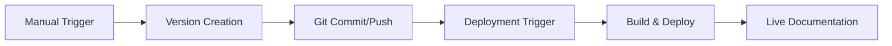

# GitHub Actions Documentation Versioning Integration

This guide details the GitHub Actions workflows that support InvenTag's documentation versioning system.

## Overview

The documentation system includes two main workflows:
1. **Documentation Deployment** - Automated building and deployment
2. **Create Documentation Version** - Manual version creation

## 🚀 Documentation Deployment Workflow

**File**: `.github/workflows/docs-deploy.yml`

### Enhanced Features for Versioning

#### Version-Aware Validation
```yaml
# Enhanced documentation structure validation
- Validates current documentation (docs/)
- Checks versioned documentation (website/versioned_docs/)
- Reports version counts from versions.json
- Validates total documentation coverage
```

#### Version-Aware Link Checking
```yaml
# Link validation covers both current and versioned docs
- Current docs: Full link validation
- Versioned docs: Sample validation (performance optimization)
- Cross-version link compatibility checking
```

#### Versioned Build Process
```yaml
# Build enhancements for versioning
- Detects versioned documentation presence
- Lists available versions during build
- Validates version-specific build outputs
- Tests version dropdown functionality
```

#### Version Testing
```yaml
# Performance testing includes version features
- Tests version dropdown presence in HTML
- Validates version-specific search indexes
- Checks version navigation functionality
```

### Triggers and Monitoring

#### Path Monitoring
The workflow now monitors additional version-related files:
```yaml
paths:
  - 'docs/**'
  - 'website/**'
  - 'version.json'
  - 'create_version.sh'          # New
  - '.github/workflows/docs-deploy.yml'
```

#### PR Preview Enhancement
Pull request previews now include version information:
- Current development version status
- Available versions list
- Version dropdown availability

## 📦 Create Documentation Version Workflow

**File**: `.github/workflows/create-docs-version.yml`

### Automated Version Creation Process

#### 1. Input Validation
```yaml
# Comprehensive version validation
- Format validation (vX.Y.Z pattern)
- Duplicate version checking
- Git tag conflict resolution
```

#### 2. Pre-flight Checks
```yaml
# Documentation readiness validation
- Validates current documentation structure
- Checks essential documentation files
- Counts available documentation files
```

#### 3. Version Creation
```yaml
# Automated Docusaurus version creation
- Creates versioned documentation snapshot
- Generates version-specific sidebars
- Updates versions.json registry
```

#### 4. Configuration Updates
```yaml
# Automatic configuration maintenance
- Updates next development version label
- Adds version-specific configuration
- Maintains version dropdown settings
```

#### 5. Build Validation
```yaml
# Comprehensive build testing
- Tests build with new version
- Validates version-specific content
- Ensures deployment readiness
```

#### 6. Git Operations
```yaml
# Automated git management
- Creates git tags (optional)
- Commits version changes
- Pushes to repository with tags
```

### Manual Trigger Interface

#### Workflow Inputs
- **Version**: Target version (e.g., `v4.3.0`)
- **Create Tag**: Whether to create git tag automatically

#### Usage
1. Navigate to **Actions** → **Create Documentation Version**
2. Click **Run workflow**
3. Enter version number
4. Select tag creation preference
5. Click **Run workflow**

## 🔄 Integration Points

### Version Creation → Deployment Flow


### Automated Workflows
1. **Version Creation** (manual) → Commits changes
2. **Documentation Deployment** (automatic) → Detects changes
3. **Build Process** → Includes all versions
4. **Deployment** → Publishes versioned site

## 📊 Monitoring and Reporting

### Build Status Reporting
Both workflows provide comprehensive status reporting:
- Build success/failure status
- Version-specific metrics
- Performance summaries
- Error diagnostics

### Artifact Management
- Version creation logs (90-day retention)
- Documentation monitoring logs (30-day retention)
- Build artifacts for debugging

### Status Integration
- PR comments with version information
- Issue comments for version creation results
- Build status badges and summaries

## 🛠️ Configuration Files Updated

### Workflow Files
- `.github/workflows/docs-deploy.yml` - Enhanced for versioning
- `.github/workflows/create-docs-version.yml` - New version creation

### Supporting Files
- `create_version.sh` - Local version creation script
- `docs/development/documentation-versioning.md` - Version guide
- `website/docusaurus.config.js` - Version configuration

## 🔧 Troubleshooting Workflows

### Common Issues

#### Version Creation Fails
1. **Check version format**: Must be `vX.Y.Z`
2. **Verify no duplicates**: Check `website/versions.json`
3. **Review git tags**: Ensure no conflicts

#### Build Fails with Versions
1. **Check versioned docs structure**: Validate file paths
2. **Review configuration**: Check `docusaurus.config.js`
3. **Test locally**: Run `npm run build` in website/

#### Deployment Issues
1. **Monitor workflow logs**: Check GitHub Actions output
2. **Verify permissions**: Ensure Pages deployment rights
3. **Test version navigation**: Check version dropdown

### Manual Recovery
If automated workflows fail:
```bash
# Manual version creation (fallback)
./create_version.sh v4.3.0

# Manual build testing
cd website
npm run build
npm run serve
```

### Getting Help
- Review workflow run logs in GitHub Actions
- Check artifact downloads for detailed logs
- Refer to [Docusaurus Versioning Docs](https://docusaurus.io/docs/versioning)

## 📈 Performance Considerations

### Build Optimization
- **Selective link checking**: Samples versioned docs for performance
- **Parallel processing**: Concurrent validation steps
- **Artifact caching**: NPM dependencies cached
- **Build output validation**: Focused on essential checks

### Resource Management
- **Artifact retention**: Balanced storage vs. debugging needs
- **Workflow concurrency**: Prevents conflicting builds
- **Timeout settings**: Appropriate for documentation size

---

This GitHub Actions integration provides a robust, automated system for managing documentation versions while maintaining quality and performance standards.